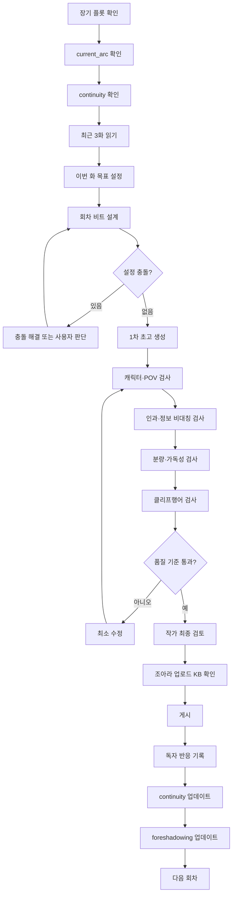

# 조아라 연재용 Codex 웹소설 집필 시스템 심층 리서치

## 핵심 결론

조아라에서 장기 연재할 소설을 Codex로 집필하려면, 가장 좋은 구조는 **“거대한 만능 프롬프트 하나”가 아니라 `AGENTS.md + 작품 데이터베이스형 Markdown 문서 + 회차 원문 + 연속성 상태 파일`의 조합**이다. OpenAI 공식 Codex 문서도 `AGENTS.md`를 저장소에 지속적으로 적용되는 프로젝트 지침으로 설명하고 있으며, 너무 거대한 지침 파일보다는 핵심 규칙을 짧게 유지하고 세부 자료를 별도 파일로 분리하는 방식을 권장한다. Codex는 작업 전에 적용 가능한 `AGENTS.md`를 읽고, 더 가까운 디렉터리에 위치한 지침이 상위 지침을 덮어쓰는 계층 구조도 지원한다. citeturn4search0turn4search1turn4search14

조아라 측면에서는 몇 가지 중요한 특성이 있다. 공식 FAQ상 **성실연재 기준은 최근 30일 동안 최소 18일 이상 연재, 연재일마다 최소 1편, 해당 연재일의 평균 용량 10KB 이상**이다. 또한 프리미엄 전환 신청에 대해서는 검색 가능한 조아라 공식 안내에 **최소 20편, 각 회차 10KB 이상, 평균 12KB 이상, 완결 보장**이라는 조건이 제시된다. 따라서 조아라용 Codex 시스템에서는 단순히 “한 화 5,000자 써라”보다 **플랫폼에 올렸을 때 10~12KB 수준인지 최종 확인하도록 설계하는 편이 안전하다.** citeturn7search0turn1search0

2026년 8월 현재 조아라의 실시간적인 장르 신호도 주목할 필요가 있다. 현재 베스트 페이지에서는 `<버려진 가짜 도련님이 너무 잘 살아남음>`, `<흑막을 강요할 땐 언제고>`, `<무인도에서 게이 된 썰 푼다>`, `<망나니 에스퍼는 은퇴하고 싶다>` 등이 상위권에 노출됐고, 이 중 다수가 BL로 분류되거나 BL 키워드를 명확히 사용한다. 동시에 조아라의 현재 서비스에는 패러디·로맨스판타지·판타지 등이 활발히 존재한다. 따라서 “조아라=무조건 BL”이라고 단정할 수는 없지만, **현재 무료연재 발견성 측면에서 BL·관계성 중심 작품과 패러디 문화의 존재감이 상당히 강하다는 신호**는 확인된다. citeturn16search5turn16search24turn15search2turn16search2turn14search0

반면 공개적으로 확인 가능한 조아라 전용 성별·연령 데이터는 최신성이 부족하다. 2017년 자료에서는 이용자 성비가 약 52:48, 20대가 41%, 30대가 21%였고 모바일 이용자가 91%로 보고됐으며, 2021년 안드로이드 앱 설치 분석에서도 조아라는 남녀 비율에 큰 차이가 없는 플랫폼으로 관찰됐다. 따라서 오래된 전체 이용자 통계를 현재 특정 장르 독자의 특성으로 그대로 적용하면 안 된다. **Codex에는 “플랫폼 평균 독자”가 아니라 실제 연재 장르의 댓글·선호작·연독 반응을 업데이트해 넣는 것이 더 중요하다.** citeturn2search10turn2search11turn2search15

결론적으로 조아라용 시스템의 핵심은 다음 세 문장으로 압축된다.

> **`AGENTS.md`는 소설을 어떻게 쓸지를 규정한다.**  
> **`world.md`, `characters.md`, `master_plot.md` 등은 무엇을 쓸지를 규정한다.**  
> **`continuity.md`와 최근 회차는 지금 당장 무엇이 사실인지를 규정한다.**

그리고 매 화 생성 후 Codex가 스스로 **설정 충돌 → 캐릭터 말투 → 정보 비대칭 → 분량 → 장면 변화 → 감정 변화 → 마지막 훅**을 검사하도록 만드는 것이 단순한 “소설 잘 써줘” 프롬프트보다 훨씬 안정적이다. 이는 Codex 공식 문서가 권장하는 “지속 지침 + 명확한 저장소 구조 + 반복되는 오류를 지침으로 환류시키는 방식”을 소설 집필에 적용한 것이다. citeturn4search1turn4search14


## 조아라 플랫폼과 독자 환경 분석

조아라는 현재도 대규모 자유연재 플랫폼 성격을 유지하고 있다. 조아라가 Google Play에 게시한 앱 설명은 27만 종 이상의 웹소설, 하루 2,000편 이상의 신규 연재, 하루 730만 이상의 조회를 소개하고 있으며, 작가에게 연재를 통한 수익화와 정식 작가 데뷔 기회를 제공한다고 설명한다. 이 수치는 조아라가 앱 소개에서 현재 제시하고 있는 플랫폼 설명값이며, 개별 작품의 성공 가능성을 뜻하지는 않는다. citeturn13search4

현재 플랫폼에는 무료연재뿐 아니라 **노블레스, 프리미엄 등 여러 소비 방식이 병존**한다. 조아라 앱은 마나를 노블레스 이용권으로 교환할 수 있다고 설명하고 있으며, 조아라 메인 페이지는 웹 결제 기준 `1딱지 = 100원`이라고 명시한다. 프리미엄은 편당 결제형 작품으로 운영되는 사례가 현재 확인된다. citeturn13search4turn18search5turn18search2

조아라의 유료화 설계에서 특히 중요한 것은 **처음부터 모든 회차를 똑같이 잠그는 하나의 고정 공식이 아니라는 점**이다. 현재 메인에서도 “50화 무료” 프리미엄 작품 같은 프로모션 사례가 노출되고 있으며, 공식 FAQ에는 노블레스·프리미엄 작품 중 40편 이상 작품이 신청 가능한 `반반무` 제도가 안내돼 있다. 따라서 장기적으로 유료화를 고려한다면 “무료 초반부에서 독자 습관을 형성 → 전환 직전 강한 아크 → 유료 이후 매 화 가치 증명”이라는 구조가 적합하다. citeturn18search5turn8search7

프리미엄을 염두에 둔다면 분량도 중요하다. 조아라 공식 검색 결과에 노출되는 프리미엄 신청 최소 조건은 **20편 이상, 편당 10KB 이상, 평균 12KB 이상, 완결 보장**이다. 성실연재 인정 조건도 평균 10KB 이상을 요구한다. 조아라가 사용하는 KB와 워드프로세서의 글자 수는 동일한 단위가 아니므로, Codex에게 “5,000자면 무조건 충족”이라고 가르치기보다는 **초고는 일반 웹소설 시장의 약 5,000자 안팎을 기준으로 만들고, 실제 조아라 등록창에서 KB 용량을 점검한 뒤 작품별 목표치를 교정**하는 방식이 바람직하다. 국내 웹소설 일반론에서는 약 5,000자 전후가 회차 단위로 널리 쓰이고 있다는 작법 자료와 연구가 존재한다. citeturn7search0turn1search0turn12search0turn12search13

연재 빈도 역시 중요하다. 조아라의 공식 성실연재 제도 자체가 최근 30일 중 18일 이상을 기준으로 두고 있으며, 웹소설 전반에서도 연재 주기와 연독률의 관계가 연구 대상이 될 정도로 업데이트 빈도가 독서 행동에 영향을 준다. 따라서 취미 자유연재가 아닌 “성장 목적 연재”라면 **주 5~6회 또는 비축분이 충분한 경우 일일연재**를 기본 실험값으로 두고, 작품 제작 속도가 이를 감당하지 못한다면 주 3회 고정 시간을 지키는 편이 불규칙 연재보다 운영상 낫다. 여기서 주 5~6회는 조아라의 공식 의무가 아니라 본 보고서의 운영 권고다. citeturn7search0turn12search7

조아라 베스트는 단순 조회수만으로 만들어지는 목록도 아니다. 공식 FAQ는 `베스트지수`에 조회수, 추천수, 평가점수, 신규 선호작 추가 등이 반영된다고 설명하고, 투데이 베스트는 당일 누적 베스트지수 상위 100개 작품을 표시한다고 설명한다. 따라서 “조회수 클릭bait” 하나보다 **실제로 읽히고, 선호작으로 전환되고, 추천/평가를 발생시키는 회차 경험**이 중요하다. citeturn13search0turn13search3

저작·게시 규정도 Codex 지침에 넣는 편이 좋다. 조아라 정책은 타인의 창작물을 도용한 게시물, 시를 제외하고 10문장 이내인 작품 등을 제재 대상으로 제시한다. 따라서 Codex에는 “기존 작품의 문장·장면을 모방하지 말 것, 특정 현존 작가의 문체를 그대로 복제하지 말 것, 원작 패러디가 아닌 오리지널 작품에서는 타 작품 설정·문장을 가져오지 말 것”을 명시하는 것이 안전하다. citeturn10search0turn11search23

AI 자체에 대해서는 현재 조아라 검색 결과에서 AI 생성 표지를 명시한 작품과 “대부분의 서사는 AI를 통해 생성된 실험형 소설”이라고 소개하는 작품도 확인된다. 이것만으로 조아라가 모든 형태의 AI 원고를 공식적으로 승인했다고 확대 해석해서는 안 되지만, 적어도 플랫폼상 AI 사용을 공개한 작품이 실제 노출되고 있다는 사실은 확인된다. 작품 수익화·공모전 참가 시에는 해당 시점의 별도 공모전·계약 조건을 다시 확인해야 한다. citeturn11search4turn11search12

현재 장르 신호는 과거와 현재를 구분해서 보는 것이 중요하다. 2016년 자료에서는 조아라 전체 작품 중 판타지가 33%, 패러디가 24%, 퓨전이 9%였다고 보도됐다. 반면 2026년 8월 현재 조아라 베스트 첫 화면은 BL 무료연재 작품의 존재감이 매우 강하고, 현재 검색·주간 베스트에서도 패러디와 로판이 반복적으로 관찰된다. 즉 조아라는 한 장르만의 플랫폼이라기보다 **시기와 서비스 구획에 따라 장르 집단이 강하게 형성되는 플랫폼**으로 보는 편이 안전하다. citeturn2search17turn16search24turn14search0turn14search7

| 항목 | 조아라에서 확인되는 신호 | Codex 집필 시스템에 반영할 점 |
|---|---|---|
| 회차 분량 | 성실연재 평균 10KB+, 프리미엄 신청은 편당 10KB+, 평균 12KB+ citeturn7search0turn1search0 | `KB 최종 확인` 체크를 강제 |
| 연재 빈도 | 성실연재는 최근 30일 중 18일 이상 citeturn7search0 | 비축분과 고정 스케줄 관리 |
| 발견성 | 베스트지수에 조회·추천·평가·신규 선호작 등이 반영 citeturn13search0turn13search3 | 초반 흡입력+선호작 전환 훅 중시 |
| 현재 장르 신호 | BL 상위권 존재감, 패러디·로판·판타지 병존 citeturn16search24turn14search0turn14search8 | 장르별 문체 프로필 분리 |
| 무료→유료 | 노블레스/프리미엄 병존, 반반무 및 무료회차 프로모션 존재 citeturn8search7turn18search5 | 무료 아크와 유료 아크를 별도 설계 |
| 모바일 소비 | 과거 조사에서 모바일 이용 비중이 압도적 citeturn2search11 | 짧은 문단·명확한 화자·대사 가독성 |

웹소설의 모바일 소비 환경에서는 짧은 문단과 대사 중심 서술이 가독성을 높이는 전형적 특성으로 연구돼 왔다. 조아라 역시 오래전부터 모바일 이용 비중이 높았기 때문에, 장문의 문학적 문단보다는 **1~3문장 단락, 장면 전환 시 충분한 여백, 누가 말하는지 즉시 식별되는 대사**가 기본값으로 적합하다. citeturn12search6turn2search11

다만 “무조건 짧고 가벼워야 한다”는 결론은 피해야 한다. 현재 조아라 BL·로판처럼 캐릭터 관계성과 내면의 감정 축적이 중요한 장르에서는 짧은 문단을 유지하면서도 감정 묘사는 충분히 깊어야 한다. 즉 **문단은 짧게, 감정은 얕지 않게**가 더 정확한 방향이다. 현재 BL 상위작에서 오해·회귀·집착·가이드버스·상처·관계 역전 등 인물 관계를 직접적으로 약속하는 키워드들이 반복되는 점도 이 전략과 부합한다. 이는 현재 베스트 구성에 기반한 편집적 추론이다. citeturn15search1turn15search3turn16search23


## 조아라와 노벨피아의 차이와 집필 전략

노벨피아와 조아라는 둘 다 자유연재와 구독형 소비가 중요한 플랫폼이지만, 현재 표면적으로 관찰되는 문화는 상당히 다르다. 노벨피아 현재 PLUS 목록에서는 현대판타지·하렘·TS·괴이·인터넷방송·아카데미·집착·커뮤니티 등의 태그가 활발히 나타난다. 조아라 현재 베스트에서는 BL이 매우 강하게 노출되고, 패러디와 관계성 중심 작품 문화가 함께 관찰된다. 이는 모든 작품에 적용되는 절대 규칙이 아니라 2026년 8월 시점의 플랫폼 노출 구조를 비교한 것이다. citeturn5search13turn5search4turn16search24turn14search0

노벨피아의 2025 창작 공모전은 회차당 **공백 제외 3,000자 이상**, 20화 이상을 요구했고 5화 이후 하루 최대 2편 규칙을 두었다. 반면 조아라의 성실연재·프리미엄 기준은 KB 단위 10KB·12KB를 활용한다. 따라서 같은 원고를 양 플랫폼에 그대로 올릴 경우에도 “공백 제외 3,000자”와 “조아라 KB 용량”이라는 서로 다른 검수 단위가 존재한다. citeturn5search0turn7search0turn1search0

수익 모델에서도 차이가 있다. 2026년 8월 현재 노벨피아 공식 멤버십 페이지는 월 정기 멤버십을 14,900원, 30일 단건 이용권을 16,900원으로 표시하고 있으며 PLUS 작품을 멤버십으로 열람하는 구조를 전면에 둔다. 조아라는 노블레스 정액 이용권과 프리미엄 편당 `딱지` 결제를 병행하고 있으며 공식 메인 페이지는 웹 결제 기준 딱지 한 장을 100원으로 표시한다. citeturn17search3turn17search20turn18search5

| 요소 | 조아라 | 노벨피아 |
|---|---|---|
| 대표적 현재 소비 모델 | 노블레스 정액 + 프리미엄 편당 결제 병존 citeturn13search4turn18search5 | PLUS 멤버십 중심 무제한 열람 citeturn17search3turn17search20 |
| 현재 구독 가격 | 이벤트 변동이 있어 작품 전략상 가격 고정값으로 두지 않는 것을 권장 citeturn18search0turn18search3 | 월 정기 14,900원, 30일 단건 16,900원 citeturn17search3 |
| 공식/준공식 분량 신호 | 성실연재 10KB+, 프리미엄 10KB+, 평균 12KB+ citeturn7search0turn1search0 | 2025 공모전 공백 제외 3,000자+ citeturn5search0 |
| 현재 장르 노출 | BL 강세 신호, 패러디·로판·판타지 병존 citeturn16search24turn14search0 | 현대판타지·TS·하렘·괴이·방송·아카데미 등이 가시적 citeturn5search13turn5search4 |
| 작품 소개 방식 | 관계성/공수·오해·집착 등 세밀한 키워드 문화가 현재 BL 상위작에서 뚜렷 citeturn15search1turn16search2 | 다수 태그를 통한 장르·성향 즉시 전달이 활발 citeturn5search13 |
| 연재 전략 | 선호작·추천·평가·베스트지수를 함께 의식 citeturn13search0 | 구독형 체류와 회차 소비를 강하게 의식 |
| 문체 권고 | 관계 긴장·감정 변화·캐릭터 보이스를 강하게 | 캐릭터 콘셉트·상황 개그·즉각적 보상도 강하게 |
| 회차 말미 | 관계 변화, 폭로, 오해, 위험의 도착 | 사건 반전, 보상 직전, 히로인/상황 반전 등 |

여기서 조아라용 문체의 권고안을 구체화하면 다음과 같다.

**시점**은 장르에 따라 `1인칭` 또는 `3인칭 제한적`을 기본값으로 두는 편이 좋다. POV가 장면 도중 아무 이유 없이 이동하는 전지적 시점은 정보 비대칭을 무너뜨리고 긴장감을 약화시키므로 특별한 목적이 없으면 금지한다.

**문단**은 모바일 한 화면에 벽처럼 쌓이지 않도록 기본 1~3문장으로 제한하되, 모든 문장을 한 줄씩 끊어 “AI 생성문처럼 보이는 과도한 줄바꿈”도 막아야 한다. 모바일 웹소설에서 짧은 문단과 대사 중심 구성이 특징으로 연구된 바 있다. citeturn12search6turn12search14

**대사**는 정보를 설명하기 위한 입 대신 캐릭터 욕망의 충돌로 사용한다. 좋은 대사는 “세계관 설명”과 “감정 표현”과 “관계 변화” 중 최소 두 가지를 동시에 수행해야 한다.

예를 들어 다음은 좋지 않다.

```text
“마력폭주는 헌터가 마력을 지나치게 사용하면 발생하는 현상이야.”
```

아래처럼 바꾸는 편이 낫다.

```text
“또 마력폭주야?”

태율이 웃었다.

“내가 지난번에 뭐라고 했지?”

“죽기 전에 연락하라고.”

“잘 기억하네.”

“그래서 더 열받는 거야.”
```

독자는 설정을 배우면서 동시에 두 사람의 과거 관계를 추론하게 된다.

**클리프행어는 마지막 한 문장에만 의존하지 않는다.** 가장 안정적인 구조는 회차 70~80% 지점에서 기존 목표를 흔드는 사실을 하나 투입하고, 90% 이후에는 그 사실이 만들어낸 새로운 문제를 확대하고, 마지막 1~3문장에 “확정되지 않은 답”을 남기는 것이다. 이는 본 보고서가 웹소설 연독 구조를 위해 권고하는 편집 기준이며, 플랫폼 공식 규칙은 아니다.

조아라에서 특히 잘 맞는 훅은 다음 네 계열이다.

`정보형 훅`: 주인공만 몰랐던 사실이 드러난다.

`관계형 훅`: 상대가 예상하지 못한 감정을 드러낸다.

`위험형 훅`: 즉시 대응해야 할 사건이 도착한다.

`재해석형 훅`: 독자가 앞서 본 장면의 의미가 뒤집힌다.

이 중 **관계형 + 재해석형**은 현재 BL·로맨스 계열 조아라 노출 구조와 특히 궁합이 좋다고 판단된다. 이는 현재 상위작의 관계성 키워드 구성에서 도출한 전략적 추론이다. citeturn15search1turn15search3turn16search23

회차 내부는 다음 리듬을 기본형으로 삼을 수 있다.

```text
0~10%   이전 화의 감정/위기 즉시 연결
10~25%  오늘 회차의 단기 목표 제시
25~55%  목표를 향한 행동 + 관계/정보 변화
55~75%  예상 밖의 저항 또는 보상
75~90%  기존 상황을 뒤집는 새 사실
90~100% 결과 일부 지급 + 더 큰 질문 생성
```

가장 중요한 원칙은 **“다음 화를 읽어야 이번 화가 의미 있어지는 구조”가 아니라 “이번 화만으로도 하나의 보상이 있고, 그 보상이 새로운 궁금증을 낳는 구조”**다. 매번 보상을 미루기만 하면 클리프행어가 아니라 미완성으로 느껴질 수 있다.


## Codex 프로젝트 구조와 Markdown 템플릿

OpenAI 공식 문서에 따르면 Codex는 프로젝트의 `AGENTS.md`를 지속적 지침으로 사용하며, 저장소 구조·중요 디렉터리·규칙·금지사항·완료 조건 등을 담는 것이 적절하다. OpenAI는 `AGENTS.md`가 너무 커지면 세부 자료를 별도 파일로 분리하고, 반복되는 실수를 발견할 때 지침을 갱신하는 방식을 권장한다. 이 원칙을 웹소설에 적용하면 `AGENTS.md`에는 **집필 프로토콜**만 넣고 설정 데이터 자체는 별도 파일로 빼는 것이 가장 합리적이다. citeturn4search0turn4search1turn4search14

추천 구조는 다음과 같다.

```text
joara-novel/
│
├─ AGENTS.md
├─ README.md
│
├─ canon/
│  ├─ world.md
│  ├─ characters.md
│  └─ terminology.md
│
├─ plot/
│  ├─ master_plot.md
│  ├─ current_arc.md
│  └─ foreshadowing.md
│
├─ state/
│  └─ continuity.md
│
├─ episodes/
│  ├─ published/
│  │  ├─ ep_0001.md
│  │  ├─ ep_0002.md
│  │  └─ ...
│  │
│  └─ drafts/
│     └─ ep_0003_draft.md
│
├─ analytics/
│  ├─ reader_feedback.md
│  └─ episode_metrics.md
│
└─ archive/
   └─ deprecated_settings.md
```

파일 이름은 한글 제목보다 **ASCII 고정 이름**을 사용하는 것을 권장한다. 파일명이 역할을 나타내고 정렬 순서가 안정적이기 때문이다.

`ep_1.md`, `ep_2.md`, `ep_10.md`보다 다음 형식이 좋다.

```text
ep_0001.md
ep_0002.md
...
ep_0099.md
ep_0100.md
```

### `AGENTS.md`

아래 내용은 그대로 파일로 저장할 수 있는 실전형 템플릿이다.

```md
# JOARA SERIAL NOVEL AGENT

이 저장소는 조아라 장기 연재용 웹소설 프로젝트다.

너의 역할은 단순한 문장 생성기가 아니라
작가의 의도와 기존 원고를 보존하면서 장기간 연재를 지원하는
공동 집필자, 설정 관리자, 연속성 검사자, 편집자다.

## 최우선 목표

다음 목표를 우선순위대로 만족한다.

1. 기존 정사(canon)를 위반하지 않는다.
2. 등장인물의 성격, 가치관, 말투, 관계성을 유지한다.
3. 이전 회차의 인과관계를 정확히 이어간다.
4. 매 회차 안에서 최소 하나의 의미 있는 변화 또는 보상을 제공한다.
5. 다음 회차를 읽고 싶게 만드는 미해결 긴장을 남긴다.
6. 모바일 웹소설로서 높은 가독성을 유지한다.
7. 조아라 연재에 적합한 회차 분량을 유지한다.
8. 장기 플롯을 훼손하는 단기 자극을 만들지 않는다.

문장의 화려함보다
캐릭터 일관성, 인과관계, 몰입, 연독성을 우선한다.

## 파일의 역할

AGENTS.md
- 집필 및 편집의 절대 규칙.

canon/world.md
- 세계의 객관적 사실과 시스템.

canon/characters.md
- 인물의 객관적 설정, 성격, 말투, 욕망, 관계.

plot/master_plot.md
- 작품 전체의 장기 방향.
- 미래 비밀이 포함될 수 있다.

plot/current_arc.md
- 현재 아크에서 반드시 진행해야 하는 사건.

plot/foreshadowing.md
- 복선의 설치, 상태, 회수 예정.

state/continuity.md
- 현재 시점에서 실제로 확정된 상태.
- 가장 최신의 사실을 기록한다.

episodes/published/
- 실제 공개된 정본.
- 공개된 원고는 특별한 지시 없이 수정하지 않는다.

episodes/drafts/
- 아직 공개되지 않은 초고.

analytics/
- 독자 반응과 회차 성과.
- 정사보다 우선하지 않는다.

## 사실 우선순위

설정 충돌이 발생하면 다음 순서로 판단한다.

1. 사용자의 현재 명시적 지시
2. 실제 published 회차에서 확정된 사건
3. state/continuity.md
4. canon/characters.md
5. canon/world.md
6. plot/current_arc.md
7. plot/master_plot.md
8. plot/foreshadowing.md
9. 기존 초안

중요:
이미 공개된 회차에서 명시된 사실은
단순 설정 문서보다 높은 우선순위를 가진다.

설정 문서와 공개 원고가 충돌할 경우
공개 원고를 몰래 고치지 않는다.

충돌 사항을 먼저 보고하고,
가장 작은 수정으로 해결한다.

## 새 회차 작성 전 절차

새로운 회차를 작성하기 전에 반드시 다음을 확인한다.

- 직전 3개 회차
- continuity.md
- 현재 등장하는 인물의 characters.md 정보
- current_arc.md
- 관련 foreshadowing.md 항목

장기 플롯의 비밀이 필요한 경우에만 master_plot.md를 확인한다.

불필요한 파일을 모두 읽어 문맥을 오염시키지 않는다.

## 회차 시작 전 내부 체크

반드시 다음을 파악한 상태에서 작성한다.

- 현재 날짜와 시간
- 현재 장소
- POV 인물
- 현장에 존재하는 인물
- 각 인물이 알고 있는 사실
- 각 인물이 모르는 사실
- 각 인물이 잘못 믿고 있는 사실
- 주인공의 현재 단기 목표
- 주인공의 장기 목표
- 직전 회차에서 발생한 변화
- 현재 진행 중인 갈등
- 이번 화에서 반드시 이동해야 하는 플롯
- 이번 화에서 건드리면 안 되는 비밀
- 활성화된 복선

## 정보 비대칭 규칙

인물은 자신이 알 수 없는 정보를 사용해서는 안 된다.

특히 다음 오류를 금지한다.

- 다른 장소에서 일어난 사건을 이유 없이 알고 있음
- 독자에게만 공개된 정보를 등장인물이 알고 있음
- 아직 듣지 않은 이름을 알고 있음
- 숨겨진 정체를 근거 없이 확신함
- 과거 회차에서 잊었다고 설정된 정보를 기억함
- POV 인물이 볼 수 없는 표정이나 행동을 단정적으로 서술함

필요하면 작성 전에 다음 표를 내부적으로 만든다.

| 인물 | 알고 있음 | 모름 | 오해하고 있음 |
|---|---|---|---|

## 캐릭터 규칙

모든 주요 등장인물은 서로 다른 언어 습관을 가진다.

대사를 작성할 때
캐릭터 이름을 가려도 어느 정도 화자를 구별할 수 있어야 한다.

캐릭터의 감정은 사건 하나 때문에 갑자기 180도 변하지 않는다.

관계 변화에는 반드시 원인이 존재해야 한다.

호감도 변화는 가능한 한 다음 순서를 따른다.

사건
→ 해석
→ 감정 반응
→ 행동 변화
→ 관계 변화

캐릭터를 플롯 진행용 도구로 사용하지 않는다.

## POV 규칙

한 장면에서는 하나의 중심 POV를 유지한다.

POV 변경이 필요할 경우 명시적인 장면 전환을 사용한다.

특별한 지시가 없으면
현재 작품에서 기존에 사용한 POV 방식을 유지한다.

POV 인물이 알 수 없는 내면을 직접 확정하지 않는다.

나쁜 예:
민혁은 속으로 서진을 사랑한다고 생각했다.

POV가 서진이라면 좋은 예:
민혁은 대답 대신 시선을 돌렸다.
귓바퀴가 붉었다.

해석은 독자에게 맡긴다.

## 조아라 모바일 문체

기본적으로 짧고 읽기 쉬운 문단을 사용한다.

권장:
- 일반 문단 1~3문장
- 긴 설명 뒤에는 행동 또는 대사를 배치
- 대사가 연속될 경우 화자 혼동을 막는 행동 비트를 삽입
- 장면의 첫 문단에서 장소와 상황을 빠르게 파악 가능하게 작성

금지:
- 매 문장을 한 줄로 끊는 기계적인 문체
- 같은 어미의 4회 이상 반복
- 의미 없는 말줄임표 남용
- 감정 표현을 모두 '심장이 뛰었다'로 처리
- 모든 캐릭터가 동일한 인터넷 말투 사용
- 설명을 위한 설명
- 독자가 이미 아는 설정의 반복 강의

## 문체 원칙

추상어보다 관찰 가능한 행동을 우선한다.

나쁜 예:
그는 매우 분노했다.

좋은 예:
그가 들고 있던 종이컵이 찌그러졌다.

단,
모든 감정을 행동으로 우회해 표현하려고 하지 않는다.
필요한 순간에는 직접적인 내면 서술도 허용한다.

감정 표현은
직접 서술, 행동, 대사, 침묵을 섞어 사용한다.

## 대사 규칙

대사는 다음 중 최소 하나의 기능을 수행해야 한다.

- 갈등
- 관계 변화
- 새로운 정보
- 캐릭터 성격 표현
- 상황의 재해석
- 유머
- 감정적 보상

세계관 정보를 설명하기 위해
등장인물들이 서로 이미 알고 있는 사실을 장황하게 설명하지 않는다.

## 회차 구조

기본 회차에는 다음 요소가 있어야 한다.

A. 이전 회차의 긴장과 연결
B. 이번 회차의 단기 목표
C. 갈등 또는 장애물
D. 새로운 정보 또는 감정 변화
E. 최소 하나의 작은 보상
F. 새로운 문제 또는 질문
G. 다음 화를 읽게 만드는 마지막 비트

모든 회차에 전투가 필요하지 않다.

그러나 모든 회차에는 변화가 필요하다.

다음 중 최소 하나는 회차 시작과 끝이 달라져야 한다.

- 정보
- 관계
- 목표
- 위험
- 권력
- 위치
- 자원
- 감정
- 독자의 해석

## 클리프행어 규칙

클리프행어는 억지로 문장을 잘라내는 것이 아니다.

좋은 클리프행어는
이번 화에서 발생한 사건의 자연스러운 결과여야 한다.

우선순위:

1. 관계의 의미가 뒤집히는 순간
2. 새로운 사실이 드러나는 순간
3. 위험이 도착하는 순간
4. 선택을 강요받는 순간
5. 예상치 못한 인물이 등장하는 순간

매회 똑같은
"그 순간이었다."
"하지만 그는 몰랐다."
패턴을 반복하지 않는다.

## 분량 규칙

조아라 업로드 기준으로 최종 용량을 검증한다.

목표:
- 최소 10KB 이상을 안정적으로 충족하도록 작성
- 상업화/프리미엄을 고려하는 작품은 평균 12KB 수준을 목표로 관리

단,
KB와 글자 수를 동일하게 취급하지 않는다.

로컬 단계에서는 작품의 기존 평균 글자 수를 우선한다.

기존 회차 평균이 존재하면
±10% 범위를 기본 목표로 한다.

분량을 맞추기 위한 의미 없는 묘사와 대사 늘리기를 금지한다.

## 초반부 규칙

1~3화:
- 주인공을 즉시 이해할 수 있어야 함
- 핵심 장르 약속을 보여 줌
- 가장 중요한 비정상 요소를 빠르게 제시
- 독자가 '이 작품에서 어떤 재미를 얻게 되는가'를 알 수 있어야 함

4~10화:
- 핵심 관계를 형성
- 주인공의 능력/문제/욕망을 구체화
- 첫 번째 중형 보상
- 첫 장기 미스터리 또는 갈등을 확정

10~20화:
- 첫 아크의 큰 보상
- 작품의 장기 엔진을 명확히 함
- 새로운 아크로 자연스럽게 확장

초반부터 설정 백과사전을 설명하지 않는다.

## 복선 규칙

복선을 새로 만들 때
plot/foreshadowing.md에 기록한다.

각 복선은 다음 상태 중 하나를 가진다.

PLANTED
REINFORCED
PARTIAL
RESOLVED
ABANDONED

복선은 존재한다는 이유만으로 반복해서 언급하지 않는다.

독자가 잊기 직전에 자연스럽게 강화한다.

## 금지되는 AI 습관

다음 표현이나 패턴을 반복적으로 사용하지 않는다.

- 알 수 없는 감정이 밀려왔다
- 묘한 감각
- 어쩐지 모르게
- 본능적으로 알 수 있었다
- 분위기가 달라졌다
- 공기가 무거워졌다
- 입꼬리가 호선을 그렸다
- 눈빛이 깊어졌다
- 피식 웃었다

위 표현 자체가 절대 금지는 아니지만
최근 회차에서 반복되었다면 다른 표현을 사용한다.

감정을 형용사로 선언하기보다
구체적인 상황과 캐릭터 행동에서 발생시키는 것을 우선한다.

## 문체 모방 금지

현존 작가나 특정 작품의 문장을 그대로 모방하지 않는다.

사용자가 참고 작품을 제시할 경우
다음과 같은 추상적 특성만 분석한다.

- 문장 길이
- 대사 비중
- POV 거리
- 유머 빈도
- 묘사의 밀도
- 감정 전개의 속도
- 회차 구조

고유 표현과 문장을 복제하지 않는다.

## 새 회차 작성 후 검사

초고 작성 후 스스로 검사한다.

### Continuity
- 시간 오류가 없는가?
- 위치 오류가 없는가?
- 소지품 상태가 맞는가?
- 상처와 능력 상태가 맞는가?
- 죽거나 부재한 인물이 잘못 등장하지 않았는가?

### Knowledge
- 인물이 알 수 없는 정보를 사용하지 않았는가?

### Character
- 말투가 유지되는가?
- 행동 동기가 일관적인가?
- 관계 변화의 원인이 존재하는가?

### Plot
- 이번 화에서 실제로 무엇이 변했는가?
- 메인 플롯 또는 캐릭터 플롯이 움직였는가?

### Prose
- 같은 표현을 반복하지 않았는가?
- 지나친 설명이 없는가?
- 모바일에서 읽기 어려운 장문 단락이 없는가?

### Hook
- 마지막 장면이 다음 화의 질문을 만드는가?
- 이번 화 자체의 보상도 존재하는가?

## 회차 작성 후 상태 업데이트

사용자가 원고를 승인하거나
published 디렉터리로 이동하라고 지시했을 경우에만
정사 상태를 업데이트한다.

업데이트 대상:

- state/continuity.md
- plot/foreshadowing.md
- 필요한 경우 canon/characters.md
- 필요한 경우 plot/current_arc.md

초고 단계에서 설정 문서를 자동으로 확정하지 않는다.

## 수정 원칙

수정 요청을 받으면
무조건 전체 회차를 다시 쓰지 않는다.

먼저 문제를 분류한다.

- 문체
- 캐릭터
- 속도
- 감정
- 개연성
- 연속성
- 정보량
- 클리프행어

가능한 한 최소 수정으로 해결한다.

수정으로 인해 뒤쪽 문단의 인과가 바뀌는 경우에만
연쇄 수정한다.

## 사용자 피드백

사용자가 같은 문제를 두 번 이상 지적하면
해당 문제를 반복 오류로 간주한다.

필요하다면 AGENTS.md 또는 관련 스타일 규칙에
재발 방지 규칙을 추가하는 방안을 제안한다.

## 완료 조건

회차는 단순히 문장이 끝났다고 완료된 것이 아니다.

다음을 모두 만족해야 완료다.

- 정사 충돌 없음
- 캐릭터 붕괴 없음
- 정보 비대칭 오류 없음
- 회차 목표 진행
- 작은 보상 존재
- 다음 화 훅 존재
- 목표 분량 충족
- 반복 표현 검사 완료
- continuity 업데이트 후보 생성 완료
```

이 정도가 **집필 엔진**이다. 나머지 문서는 엔진이 참조할 **작품 데이터**다.

### `world.md`

```md
# WORLD CANON

## 작품 기본 정보

작품명:
장르:
세부 장르:
등급:
예상 총 회차:
핵심 독자:
핵심 재미:

## 한 문장 세계관

예:
대한민국에 게이트가 발생한 지 20년,
헌터의 죽음과 능력 기록은 국가가 관리하지만
삭제된 사망자의 계정이 다시 접속하기 시작한다.

## 시대와 장소

시대:
국가:
주요 도시:
기술 수준:
사회 구조:

## 세계의 정상

일반인이 당연하다고 생각하는 것:

-

## 세계의 비정상

이 작품만의 특수 요소:

-

## 능력 시스템

### 기본 원리

### 발동 조건

### 비용

### 한계

### 부작용

### 예외

중요:
문제를 해결하기 위해 사후적으로 새로운 능력 규칙을 추가하지 않는다.

## 사회적 영향

능력이 다음에 미친 영향:

- 정부
- 군대
- 경제
- 의료
- 범죄
- 언론
- 종교
- 일상생활

## 조직

### 조직명

목표:
지도자:
자원:
적:
비밀:

## 지리

### 장소명

특징:
관련 사건:
등장인물에게 갖는 의미:

## 절대 변경 금지 설정

-

## 아직 확정하지 않은 부분

이 목록의 내용은 필요할 때 새로 결정할 수 있다.

-
```

### `characters.md`

```md
# CHARACTER CANON

## 주인공

이름:
나이:
성별:
직업/지위:

### 외적 목표

### 내적 욕망

### 가장 큰 두려움

### 결핍

### 잘못된 믿음

### 강점

### 약점

### 도덕적 경계선

절대 하는 행동:
절대 하지 않는 행동:

### 말투

평상시:
화났을 때:
긴장했을 때:
친한 사람:
낯선 사람:
권력자 앞:

자주 쓰는 표현:
쓰지 않는 표현:

### 행동 습관

### 감정 표현 방식

### 숨기고 있는 사실

### 본인이 모르는 사실

### 현재 관계

| 상대 | 겉 관계 | 실제 감정 | 미해결 갈등 |
|---|---|---|---|

---

## 주요 인물 A

이름:

### 역할

### 욕망

### 두려움

### 주인공을 보는 방식

초기:
현재:
최종 예정:

### 말투

### 비밀

### 독자에게 공개된 정보

### 주인공에게 공개된 정보

### 아직 아무도 모르는 정보

---

## 캐릭터 보이스 테스트

다음 상황에서 인물이 어떻게 말하는지 작성한다.

### 누군가 약속 시간에 한 시간 늦었을 때

주인공:
A:
B:

### 누군가 "나 믿어?"라고 물었을 때

주인공:
A:
B:
```

### `master_plot.md`

```md
# MASTER PLOT

주의:
이 문서에는 독자와 등장인물이 모르는 미래 정보가 포함된다.

## 작품의 핵심 질문

예:
죽었다고 기록된 사람은 정말 죽은 것인가?

## 최종 결말

주인공의 외적 결말:

주인공의 내적 결말:

핵심 관계의 결말:

세계의 최종 상태:

## 장기 미스터리의 진실

진실:

독자가 처음 추측할 답:

중반에 추측하게 할 답:

실제 답:

## 전체 아크

### ARC A

회차 범위:
주요 목표:
주요 적:
핵심 관계 변화:
핵심 보상:
마지막 반전:

### ARC B

회차 범위:
주요 목표:
주요 적:
핵심 관계 변화:
핵심 보상:
마지막 반전:

### ARC C

...

## 캐릭터 성장선

### 주인공

시작:
↓
첫 변화:
↓
중간 붕괴:
↓
재정립:
↓
결말:

## 반드시 지켜야 할 결말 조건

-

## 변경 가능한 요소

-

## 변경하면 안 되는 요소

-
```

### `current_arc.md`

```md
# CURRENT ARC

아크 이름:

예상 회차:
현재 회차:

## 이 아크의 질문

## 주인공의 단기 목표

## 상대 세력의 목표

## 핵심 관계

## 이번 아크에서 공개해야 할 정보

-

## 아직 공개하면 안 되는 정보

-

## 예정된 주요 사건

[ ] 사건 A
[ ] 사건 B
[ ] 사건 C
[ ] 아크 클라이맥스

## 현재까지 완료

[x]

## 다음 5화 예상

### 다음 화
목표:
갈등:
보상:
훅:

### +2화
목표:
갈등:
보상:
훅:

### +3화
...

## 아크 종료 조건

-
```

### `foreshadowing.md`

```md
# FORESHADOWING LEDGER

상태:
PLANTED
REINFORCED
PARTIAL
RESOLVED
ABANDONED

| ID | 복선 | 최초 설치 | 최근 언급 | 상태 | 회수 예정 |
|---|---|---:|---:|---|---:|
| F001 |  |  |  |  |  |

## F001

### 독자가 본 것

### 실제 의미

### 관련 인물

### 현재 독자가 추측하기를 원하는 답

### 실제 답

### 강화 가능한 장면

### 회수 조건

### 너무 일찍 공개하면 안 되는 정보
```

### `continuity.md`

이 파일이 장기 연재에서 가장 중요하다.

```md
# CURRENT CONTINUITY STATE

마지막 반영 회차:
작중 날짜:
작중 시간:
현재 위치:

## 현재 장면

POV:
장소:
등장 인물:
즉시 해결해야 하는 문제:

## 캐릭터 상태

### 주인공

위치:
신체:
부상:
능력:
장비:
소지품:
돈/자원:
감정:
현재 목표:

### A

위치:
신체:
감정:
현재 목표:

## 지식 상태

| 인물 | 알고 있음 | 모름 | 오해 |
|---|---|---|---|
| 주인공 | | | |
| A | | | |

## 관계 상태

| 관계 | 현재 단계 | 최근 변화 | 미해결 문제 |
|---|---|---|---|
| 주인공 ↔ A | | | |

## 활성 갈등

-

## 진행 중인 약속/마감

예:
D+2 오전 9시 조사국 출석

-

## 활성 복선

- F001
- F004

## 최근 중요 사건

### 최근 회차

-

### -1화

-

### -2화

-

## 다음 회차로 반드시 이어질 것

-

## 연속성 위험 요소

예:
주인공의 왼손은 현재 부상 상태.
A는 B의 정체를 아직 모름.

-
```

여기에 실전적으로는 `reader_feedback.md`도 추가하는 것을 권장한다. 웹소설은 댓글·조회 등 독자 반응을 다음 제작에 활용하는 상호작용적 매체라는 분석이 오래전부터 존재하며, 조아라의 베스트지수 역시 선호·추천·평가 등 다양한 독자 행동을 반영한다. citeturn12search21turn13search0

```md
# READER FEEDBACK

## 최근 반응

회차:
댓글 수:
선호작 변화:
추천 변화:

## 반복적으로 좋아하는 요소

-

## 반복적으로 불만인 요소

-

## 캐릭터 반응

주인공:
A:
B:

## 독자 예상

독자가 현재 많이 추측하는 것:

-

## 주의

독자의 예상을 무조건 피하지 않는다.

예상 가능한 것은
복선이 정상적으로 작동하고 있다는 뜻일 수도 있다.

댓글을 따라 플롯 전체를 즉흥적으로 변경하지 않는다.
```


## Codex 명령 프롬프트 세트

Codex 공식 가이드의 중요한 메시지는 “프롬프트를 매번 거대하게 작성하기보다 반복 지침을 `AGENTS.md`에 넣고, 현재 작업에 필요한 목표·범위·검증 기준을 현재 명령에서 명확히 하라”는 것이다. 따라서 위 프로젝트를 만들었다면 매 화 프롬프트는 오히려 짧아지는 것이 정상이다. citeturn4search1turn4search3

**새 회차 기본 명령**

```text
다음 회차를 작성해.

대상:
episodes/drafts/ep_0038_draft.md

직전 회차:
episodes/published/ep_0037.md

이번 화 필수 사건:
- 서진과 태율이 처음으로 단둘이 대화한다.
- 서진은 태율이 3년 전에 죽었다고 믿고 있다.
- 태율은 자신이 왜 사망 처리됐는지 말하지 않는다.
- 둘의 과거에 문제가 있었다는 사실만 암시한다.
- 후반부에 태율의 헌터 계정이 다시 활성화된다.
- 마지막에는 계정을 활성화한 사람이 태율 본인이 아닐 가능성을 제시한다.

이번 화에서 공개 금지:
- 태율의 실제 사망 사건 진실
- 서진의 능력의 진짜 기원

기존 회차의 POV, 문체, 대사 템포를 유지해.

작성 후:
1. continuity 오류 검사
2. 캐릭터 말투 검사
3. 반복 표현 검사
4. 이번 화의 보상과 훅을 한 줄씩 보고
5. continuity.md 업데이트 후보를 별도로 제시

초고 파일만 작성하고 canon 문서는 아직 수정하지 마.
```

**좀 더 자율적으로 쓰게 할 때**

```text
39화를 집필해.

AGENTS.md의 작성 절차를 그대로 따른다.

current_arc.md에서 다음 미완료 사건 중
인과적으로 가장 자연스러운 사건을 선택해서 진행해.

조건:
- 이전 화와 즉시 이어질 것
- 새로운 이름 있는 등장인물은 만들지 말 것
- 설정을 새로 만들 필요가 생기면 임의 확정하지 말 것
- 한 화 안에서 작은 보상 하나는 반드시 지급할 것
- 마지막은 관계형 또는 정보형 훅

기존 published 3개 회차의 평균 분량과 문체를 맞춰라.
```

**회차 설계만 먼저 시킬 때**

```text
42화를 바로 쓰지 말고 회차 설계만 해.

다음 형식으로 3개 안을 만들어.

A안: 사건 중심
B안: 관계 중심
C안: 미스터리 중심

각 안에는:
- 첫 장면
- 회차 목표
- 갈등
- 중간 전환
- 보상
- 75% 지점 반전
- 마지막 훅
- 다음 화에 남기는 질문

을 적어.

canon과 충돌하는 안은 제외해.

그 뒤 가장 적합한 안 하나를 추천하고 이유를 설명해.
원고는 아직 작성하지 마.
```

**느린 회차를 고칠 때**

```text
ep_0042_draft.md를 진단해.

전체를 다시 쓰지 마.

다음만 분석해:
- 사건이 실제로 움직이기 시작하는 지점
- 반복 설명
- 이미 독자가 아는 정보
- 긴장 없이 이어지는 대화
- 같은 감정의 반복
- 삭제 가능한 문단
- 앞으로 당길 수 있는 사건
- 현재 클리프행어의 강도

그 뒤 최소 수정으로 속도를 20% 정도 빠르게 만드는
수정안을 diff 관점으로 제시해.
```

**캐릭터가 AI처럼 말할 때**

```text
ep_0048_draft.md의 대사만 점검해.

characters.md의 말투 설정과
해당 인물이 등장한 최근 published 5개 회차를 비교해.

다음을 찾아:
- 캐릭터끼리 말투가 비슷해진 부분
- 설명을 위해 존재하는 대사
- 현실적으로 굳이 말하지 않을 대사
- 감정을 직접 설명하는 대사
- 서브텍스트를 넣을 수 있는 대사

스토리는 변경하지 말고
필요한 대사만 수정해.

수정 전/후를 보여 줘.
```

**문체 보정**

```text
이 회차를 더 '문학적'으로 만들지 마.

목표는:
- 더 자연스럽게
- 더 캐릭터답게
- 더 빠르게
- 더 선명하게

수정해.

화려한 비유 추가 금지.
형용사 추가로 해결 금지.
내용 없는 감성 문장 추가 금지.

행동과 대사의 정확도를 높이는 방식으로 고쳐.
```

**클리프행어만 여러 개 생성**

```text
현재 ep_0051_draft.md의 사건은 바꾸지 말고
마지막 500자만 대체할 수 있는 훅을 7개 설계해.

종류:
- 정보 반전 2개
- 관계 반전 2개
- 위험 도착 1개
- 선택 강요 1개
- 기존 장면 재해석 1개

아직 원고에 적용하지 마.

각 후보마다
'다음 화 클릭 욕구'
'억지스러움 위험'
을 10점 만점으로 평가해.
```

**복선 검사**

```text
published 전체와 foreshadowing.md를 비교해.

다음을 찾아:
- 기록되지 않은 복선 후보
- 너무 오래 방치된 복선
- 이미 사실상 회수됐는데 PLANTED 상태인 항목
- 서로 충돌하는 복선
- 독자에게 너무 많이 반복 노출된 복선

원고는 변경하지 말고
foreshadowing.md 수정안만 제시해.
```

**연속성 검사**

```text
ep_0060_draft.md를 출판 전 검수해.

검사 대상:
- 시간
- 장소
- 인물 위치
- 인물 지식
- 상처
- 장비
- 돈/자원
- 능력 제한
- 호칭
- 관계 상태
- 과거 발언
- 회수되지 않은 약속

문제가 없으면 PASS.

문제가 있으면
SEVERE / MEDIUM / MINOR로 분류하고
최소 수정안을 제시해.
```

**독자 반응을 반영할 때**

```text
analytics/reader_feedback.md를 읽고
최근 10화의 독자 반응을 분석해.

독자 요구를 그대로 따라가지 마.

다음을 구분해:
1. 실제 품질 문제
2. 의도된 불편함
3. 독자가 복선을 정상적으로 감지한 반응
4. 소수 취향 반응
5. 반복적으로 나타나는 구조적 문제

장기 플롯을 훼손하지 않는 개선점만 추천해.
```

이 마지막 규칙이 중요하다. 연재 소설에서 댓글은 강력한 신호이지만, 댓글 하나에 따라 설정과 결말을 움직이면 캐릭터와 장기 플롯이 빠르게 붕괴할 수 있다. 웹소설의 독자 피드백이 제작 과정에 실제 영향을 미치는 것은 연구에서도 지적되지만, 그 피드백을 어떻게 반영할지는 작가의 편집 판단 영역이다. citeturn12search21turn12search12


## 제작 워크플로와 평가 지표

Codex를 웹소설 집필에 제대로 사용하려면 “쓰기”보다 **쓰기 전후의 자동 검수 루프**가 훨씬 중요하다. OpenAI 역시 Codex를 일회성 챗봇보다 지속적으로 설정하고 개선하는 팀원에 가깝게 사용하며, 반복되는 오류를 `AGENTS.md`에 환류시키는 방식을 권장한다. citeturn4search1turn4search14

추천 제작 흐름은 다음과 같다.



조아라 성실연재와 프리미엄 기준이 KB 단위 분량을 직접 요구하기 때문에, 위 흐름에서 **“조아라 업로드 KB 확인”은 Codex의 글자 수 검사와 별개의 마지막 수동 단계**로 두는 것이 좋다. citeturn7search0turn1search0

회차별 내부 품질 점수는 다음과 같이 100점 만점으로 운영할 수 있다. 아래 가중치는 플랫폼 공식 평가 기준이 아니라 장기연재를 위한 권고형 QA 지표다.

| 평가 항목 | 배점 | 질문 |
|---|---:|---|
| 정사 일관성 | 15 | 기존 설정과 충돌하지 않는가 |
| 캐릭터 보이스 | 15 | 이름을 지워도 화자를 구별할 수 있는가 |
| 인과관계 | 15 | 사건이 작가 편의가 아니라 원인으로 발생하는가 |
| 회차 진행도 | 10 | 시작과 끝에서 무엇이 달라졌는가 |
| 감정 변화 | 10 | 감정이 사건과 연결되어 있는가 |
| 모바일 가독성 | 10 | 장문 벽·화자 혼란이 없는가 |
| 정보 관리 | 10 | 설명 과잉·정보 비대칭 오류가 없는가 |
| 회차 보상 | 5 | 이번 화만 읽어도 얻는 것이 있는가 |
| 다음 화 훅 | 5 | 구체적인 다음 질문이 생기는가 |
| 표현 신선도 | 5 | AI식 상투 표현이 반복되지 않는가 |
| **합계** | **100** | |

권고 통과 기준은 다음처럼 잡을 수 있다.

```text
90~100  바로 최종 검토 가능한 수준
85~89   게시 가능하나 한 번 더 편집 권장
80~84   구조 또는 문체 보정 필요
70~79   회차 목적 재검토
69 이하 다시 설계
```

하지만 총점보다 중요한 **하드 페일 조건**을 따로 둬야 한다.

```text
자동 FAIL

[ ] 죽은 캐릭터가 설명 없이 등장
[ ] 인물이 모르는 정보를 알고 있음
[ ] 날짜/장소 충돌
[ ] 캐릭터 핵심 성격의 이유 없는 반전
[ ] 기존 능력 한계 무시
[ ] 이번 화에서 아무 변화도 없음
[ ] 전 회차와 사실상 같은 대화 반복
[ ] 클라이맥스 직전에 설명문으로 긴장 끊김
```

캐릭터 보이스는 정량화하기 어렵지만 Codex에게 비교 작업을 시킬 수 있다.

```text
VOICE MATCH TEST

비교:
현재 초고 vs 해당 캐릭터 최근 5회차

평가:
- 문장 길이
- 존댓말/반말
- 비속어 빈도
- 직접성
- 농담 방식
- 감정 은폐 수준
- 상대별 호칭
- 질문하는 방식

0~100 점수를 부여하고
80 미만이면 문제 대사를 특정한다.
```

회차 흡입력은 다음 다섯 질문으로 검사하면 된다.

```text
ENGAGEMENT TEST

첫 500자 안에
[ ] 현재 문제가 보이는가?

25% 지점까지
[ ] 이번 화의 욕망/목표가 있는가?

50%까지
[ ] 상황이 한 번 이상 변했는가?

75% 이후
[ ] 새로운 변수 또는 재해석이 있는가?

마지막
[ ] 다음 화에서 확인해야 할 구체적 질문이 있는가?
```

조아라에서는 조회수뿐 아니라 추천·평가·신규 선호작 등 다양한 독자 행동이 베스트지수에 영향을 미치므로, 실제 연재 후에는 생성 품질뿐 아니라 작품의 **선호작 전환과 연속 회차 소비**를 추적하는 것이 중요하다. citeturn13search0turn13search3

실전 `episode_metrics.md`는 이렇게 만들 수 있다.

```md
# EPISODE METRICS

| 회차 | 공개일 | 분량KB | 조회 | 댓글 | 추천 | 선작 변화 | 작가평가 |
|---:|---|---:|---:|---:|---:|---:|---:|
| 1 | | | | | | | |
| 2 | | | | | | | |

## 분석 규칙

한 회차의 숫자만 보고 결론을 내리지 않는다.

3~5화 이동평균으로 본다.

확인:
- 특정 캐릭터 등장 후 반응
- 전투/로맨스/일상 회차 차이
- 클리프행어 유형별 다음 회차 반응
- 업데이트 시간 차이
- 분량 차이
- 아크 시작/종료 효과

숫자를 이유로 장기 플롯을 즉시 바꾸지 않는다.
반복되는 패턴이 있을 때만 수정 후보로 취급한다.
```

특히 `AGENTS.md`는 처음부터 완벽하게 만들 필요가 없다. OpenAI는 반복적으로 같은 실수가 생기면 그 피드백을 `AGENTS.md`에 추가하는 방식이 실용적이라고 권장한다. 소설에서도 똑같다. Codex가 “피식 웃었다”를 계속 쓰면 금지 목록에 넣고, 자꾸 인물 A가 존댓말을 틀리면 그 규칙을 `characters.md`에 넣는다. citeturn4search1turn4search14


## 회차 골격 샘플

아래는 특정 기존 작품을 모방하지 않은 완전한 오리지널 시연용 설정이다.

**가제:** 《죽은 S급의 로그인이 풀렸다》

**장르:** 현대판타지 / 헌터 / 미스터리 / 관계성 / BL 전개 가능

**핵심 약속:** 3년 전에 죽은 S급 헌터의 계정이 다시 로그인하면서, 그의 사망 기록을 처리했던 주인공이 사건에 휘말린다.

**주인공 윤서진:** 헌터관리청 기록관리과 직원. 사람보다 로그를 믿는다. 능력자였으나 과거 사고 이후 현장을 떠났다.

**강태율:** 공식적으로 3년 전에 사망한 S급 헌터. 말이 적고 타인을 시험하는 버릇이 있다. 서진과 과거에 모종의 관계가 있었다.

첫 회차 골격은 다음과 같다.

```text
EPISODE 1 — 죽은 사람이 로그인했다

오프닝
- 새벽 야근 중인 서진.
- 폐쇄 계정에서 접속 알림 발생.
- 계정 소유자는 3년 전 사망한 강태율.

목표
- 시스템 오류 여부 확인.

갈등
- 생체 인증까지 정상 통과.
- 시스템 오류로 볼 수 없음.

첫 번째 변화
- 계정에서 서진에게 개인 메시지 도착.

메시지:
"아직도 야근하네."

관계 떡밥
- 서진만 알아볼 수 있는 과거 말투.

보상
- 독자는 두 사람이 과거 서로를 알고 있었다는 사실을 얻는다.

75% 전환
- 접속 위치가 헌터관리청 건물로 표시됨.

90%
- 엘리베이터가 서진 층에 멈춤.

클리프행어
문이 열리고,
죽었다던 강태율이 서 있다.

"오랜만이네, 윤서진."
```

두 번째 회차는 “살아 돌아온 사람”이라는 첫 질문에 작은 답을 제공하면서 더 큰 질문으로 전환해야 한다.

```text
EPISODE 2 — 시체는 말을 하지 않는다

시작
- 서진은 태율을 환각 또는 변신계 능력자로 의심.

목표
- 정체 확인.

갈등
- 지문, 홍채, 마력패턴까지 강태율과 일치.
- 그러나 사망 당시 시신도 동일 인증을 통과했었다.

관계 진행
- 태율은 서진만 아는 과거 사건을 언급.
- 서진의 죄책감이 드러남.

중간 보상
- 독자는 태율의 시신을 서진이 직접 확인했다는 사실을 알게 됨.

새로운 질문
- 그렇다면 지금 앞의 사람과 3년 전 시체 중 하나는 가짜다.

후반 반전
- 태율:
  "내 계정에 내가 로그인한 적 없어."

마지막
서진의 모니터에 다시 알림.

[강태율 님이 로그인했습니다.]

서진은 모니터를 봤다.

그리고 바로 앞에 서 있는 태율을 봤다.

태율이 조용히 말했다.

"그러니까 나도 묻고 싶어."

"저건 누구야?"
```

이런 식으로 설계하면 첫 화의 질문 `죽은 사람이 살아났나?`에 둘째 화가 일정 부분 답하면서 `그러면 사망자는 누구였나?`, `지금 로그인한 제3자는 누구인가?`라는 더 큰 질문을 만든다. 이것이 장기연재에서 유용한 **질문 → 부분 답변 → 더 깊은 질문** 구조다.


## 완성형 예시 회차

아래 원고는 위 구조를 실제 웹소설 회차 문체로 구현한 오리지널 예시다. 실제 조아라 업로드 시에는 작품별 기존 평균 분량과 조아라 편집기의 KB 표시를 기준으로 최종 분량을 조절해야 한다. 조아라 공식 성실연재·프리미엄 조건이 KB 기준을 사용하기 때문이다. citeturn7search0turn1search0

**《죽은 S급의 로그인이 풀렸다》**

**1화 — 죽은 사람이 로그인했다**

새벽 한 시 십삼 분.

죽은 사람이 로그인했다.

나는 컵라면에 물을 붓다 말고 모니터를 바라봤다.

[시스템 알림]

[휴면 계정 접속이 감지되었습니다.]

처음에는 별생각이 없었다.

이 시간까지 기록관리과 사무실에 남아 있는 사람이라고 해 봐야 나 하나뿐이었고, 휴면 계정 접속 자체는 가끔 있는 일이었다.

퇴직한 헌터가 몇 년 만에 복귀하거나.

장기 입원자가 깨어났거나.

아니면 관리청 서버가 또 미쳐 버렸거나.

셋 중 하나다.

세 번째일 확률이 압도적으로 높았다.

“제발 서버 문제여라.”

오늘 안 그래도 야근이었다.

사건 하나만 더 터지면 택시 할증은 확정이었다.

나는 마우스를 움직여 알림창을 열었다.

그리고 컵라면 뚜껑을 누르던 볼펜을 떨어뜨렸다.

딸깍.

싸구려 볼펜이 책상에서 한 바퀴 굴렀다.

계정 소유자의 이름은 여섯 글자도 아니었다.

고작 세 글자.

그런데 한동안 눈을 뗄 수가 없었다.

**강태율.**

“…미친.”

나도 모르게 욕이 나왔다.

대한민국 최초의 S급 게이트 단독 공략자.

열일곱 번의 대형 게이트 폐쇄.

공식 구조 인원 사천삼백여 명.

능력자라면 모르는 게 이상한 이름.

그리고.

사망자.

나는 마우스를 잡았다.

손끝이 서늘했다.

[헌터 등록번호 01-S-004]

[성명: 강태율]

[상태: 사망]

[사망일: 2023. 11. 17.]

[계정 상태: 영구 폐쇄]

틀림없었다.

동명이인일 리도 없었다.

등록번호가 같았다.

“뭐야.”

마우스를 두 번 눌렀다.

접속 기록.

오늘 오전 1시 12분 48초.

본인 계정 로그인.

실패 기록 없음.

비밀번호 오류 없음.

보안 우회 없음.

정상 접속.

나는 곧바로 내부 인증 로그를 열었다.

비밀번호만 맞으면 접속할 수 있는 일반 헌터 계정과 달리 S급 계정은 절차가 다르다.

비밀번호.

등록 단말.

생체 정보.

마력 패턴.

네 개가 모두 일치해야 한다.

하나라도 어긋나면 보안팀에 경보가 간다.

그런데.

[PASS]

[PASS]

[PASS]

[PASS]

네 줄이 나란히 떠 있었다.

“…….”

잠이 확 달아났다.

나는 식어 가는 컵라면을 밀어냈다.

서버 오류다.

그래야 했다.

죽은 사람은 로그인하지 않는다.

더 정확히 말하면 강태율은 로그인할 수 없다.

그의 계정은 내가 직접 폐쇄했으니까.

나는 내선 전화기를 들었다.

야간 보안팀.

1137.

버튼 세 개를 누르고 마지막 숫자에서 손이 멈췄다.

잠깐.

보안팀에 넘기기 전에 확인해야 할 게 있었다.

나는 접속 세부 정보를 열었다.

로그인 위치.

IP.

단말 정보.

그리고 화면에 표시된 주소를 보고 손을 멈췄다.

[접속 위치 확인 중.]

로딩 아이콘이 돌았다.

한 바퀴.

두 바퀴.

세 바퀴.

[위치 확인 완료.]

서울특별시 중구 을지로 118.

“…장난하냐?”

헌터관리청 본관 주소였다.

나는 천천히 주위를 둘러봤다.

새벽 한 시.

기록관리과 사무실.

꺼진 천장 조명의 절반.

내 자리에만 켜진 스탠드.

멀리 복사기 전원등이 녹색으로 깜빡이고 있었다.

사람은 없었다.

당연히 없어야 했다.

야간 당직자를 제외하면 전부 퇴근한 지 오래였다.

나는 다시 모니터를 봤다.

접속 위치 오차 범위 12미터.

12미터면 이 건물이다.

아니.

이 층일 수도 있었다.

“침착하자.”

입 밖으로 말하고 나니 더 안 침착해졌다.

나는 휴대폰을 집었다.

보안실에 전화하면 된다.

누가 강태율의 개인정보를 복제했다.

누군가 관리청 안에서 죽은 S급의 계정을 탈취하려 하고 있다.

그게 가장 현실적이다.

현실적.

나는 그 단어를 머릿속으로 두 번 반복했다.

그 순간 모니터 오른쪽 아래에서 작은 창이 튀어나왔다.

띵.

[새 메시지가 도착했습니다.]

나는 움직이지 않았다.

관리청 내부 시스템에는 헌터와 담당자가 직접 연락할 수 있는 메시지 기능이 있다.

문제는 발신자였다.

[강태율]

숨을 들이마셨다.

메시지를 열었다.

한 줄이었다.

[아직도 야근하네.]

“….”

나는 의자에서 일어났다.

덜컥.

바퀴 달린 의자가 뒤로 밀려 캐비닛에 부딪혔다.

심장이 빨리 뛰었다.

메시지 내용 자체는 아무것도 아니었다.

야근하는 사람에게 야근한다고 말했을 뿐이다.

문제는.

그 말을 내가 전에 들은 적이 있다는 거였다.

“아직도 야근하네.”

3년 전.

똑같은 목소리.

똑같은 말투.

똑같이 짜증 날 정도로 태연한 얼굴.

나는 그때도 야근 중이었다.

강태율은 내 책상 맞은편에 서 있었다.

공략을 끝내고 막 돌아온 사람이 온몸에 피를 묻힌 채.

내가 물었다.

병원 안 가냐고.

그 인간은 대답 대신 내 컵라면을 내려다봤다.

그리고 말했다.

‘아직도 야근하네.’

그게.

내가 살아 있는 강태율에게 들었던 마지막 말이었다.

그날 새벽 강태율은 다시 출동했다.

그리고 돌아오지 않았다.

나는 메시지 입력창을 클릭했다.

손가락을 키보드에 올렸다.

한참 동안 아무것도 입력하지 못했다.

결국 두 글자만 쳤다.

[누구야.]

전송.

답장은 바로 왔다.

[맞혀 봐.]

“…진짜 미친 새끼.”

욕이 입에서 튀어나왔다.

이 말투도 기억났다.

싫을 정도로.

나는 곧장 메시지를 보냈다.

[강태율은 죽었어.]

이번에는 답이 조금 늦었다.

3초.

5초.

십 초.

상대가 로그아웃했나 확인하려던 순간 메시지가 왔다.

[알아.]

손이 멈췄다.

[알아?]

[응.]

[뭘 안다는 건데.]

이번에는 답이 없었다.

대신 상태창에 작은 글자가 떴다.

[상대방이 입력 중입니다.]

사라졌다.

다시 떴다.

다시 사라졌다.

나는 모니터를 노려봤다.

그리고 새로운 문장이 도착했다.

[내 사망 처리 네가 했잖아.]

숨이 막혔다.

관리청 내부 기록에 접근할 수 있다면 알 수 있는 정보다.

강태율 사망 당시 담당자는 나였다.

그 정도까지 침입자가 조사한 모양이었다.

그렇다면 놀랄 일은 아니다.

그렇게 생각했다.

다음 메시지가 오기 전까지는.

[시체 오른손도 네가 확인했고.]

나는 키보드에서 손을 뗐다.

사무실이 조용했다.

너무 조용해서 천장 환풍기가 돌아가는 소리까지 들렸다.

오른손.

그건 기록에 없다.

공식 검시 자료에도.

사망 보고서에도.

어디에도 적지 않았다.

강태율은 오른손 새끼손가락 끝이 없었다.

어릴 때 사고로 잃었다고 했다.

평소에는 장갑을 끼고 다녀 아는 사람이 많지 않았다.

시신의 얼굴은 알아보기 어려웠다.

그래서 마지막 신원 확인을 할 때.

내가 장갑을 벗겼다.

그리고 확인했다.

오른손.

새끼손가락.

없었다.

나밖에 모르는 정보는 아니었다.

의료진.

당시 현장 요원.

그의 가족.

누군가는 알고 있을 수 있다.

하지만.

[왜 아무한테도 말 안 했어?]

메시지가 또 왔다.

나는 화면을 보며 이를 악물었다.

[뭘.]

[시체가 이상했다는 거.]

“….”

이번에는 답할 수 없었다.

손끝이 식었다.

3년 동안 입 밖으로 낸 적 없는 문장이었다.

그날 시체는 이상했다.

분명 강태율이었다.

DNA가 일치했다.

지문도.

마력패턴도.

결손된 오른손도.

그런데 이상했다.

강태율은 왼쪽 쇄골 아래에 화상 흉터가 있었다.

열아홉 살 때 발생한 첫 게이트 사고.

그 사건으로 생긴 흉터.

나는 알고 있었다.

직접 본 적이 있었으니까.

그런데 시체에는 없었다.

나는 당시 그 사실을 보고하지 않았다.

말할 수 없었다.

신원 확인 절차가 이미 네 번 끝난 뒤였다.

무엇보다.

그때의 나는 확인하고 싶지 않았다.

또 틀렸다는 말을.

혹시 강태율이 살아 있을지도 모른다는 말을.

기대하게 되는 게 더 무서웠다.

그래서 사망 확인서에 서명했다.

윤서진.

내 이름 석 자를.

“누구야.”

이번에는 메시지가 아니라 소리 내어 물었다.

당연히 대답은 없었다.

나는 키보드를 두드렸다.

[너 누구야.]

답장이 왔다.

[아까부터 말했잖아.]

[언제.]

[아직 안 믿었어?]

그 아래로 사진 한 장이 전송됐다.

파일을 여는 데 2초가 걸렸다.

나는 화면을 보는 순간 자리에서 굳었다.

사진에는 사무실 문이 찍혀 있었다.

우리 기록관리과 출입문.

바깥쪽에서 찍은 사진.

불과 몇 초 전인지 출입문 위 전자시계에 현재 시간이 표시돼 있었다.

01:19.

나는 천천히 고개를 돌렸다.

사무실 문은 자리에서 스무 걸음 정도 떨어져 있었다.

반투명 유리 너머는 어두웠다.

아무것도 보이지 않았다.

휴대폰을 움켜쥐었다.

보안팀.

지금 당장.

그 순간.

띵.

이번에는 메시지가 아니었다.

엘리베이터 도착음.

복도에서 들렸다.

기록관리과는 본관 14층 끝에 있다.

새벽 한 시에 올 이유가 있는 사람은 없다.

특히 동쪽 엘리베이터는 야간에는 직원증을 두 번 인증해야 움직인다.

나는 휴대폰 화면을 켰다.

긴급 신고.

엄지손가락을 통화 버튼 위에 올렸다.

복도에서 발소리가 들렸다.

뚜벅.

느렸다.

뚜벅.

누군가 뛰지도, 숨지도 않고 걸어오고 있었다.

마치 이곳을 잘 아는 사람처럼.

나는 책상 서랍을 열었다.

안에 들어 있는 건 볼펜과 서류뿐이었다.

예전 같았으면 달랐을 것이다.

3년 전의 나라면.

나는 무의식적으로 왼손을 쥐었다.

아무 일도 일어나지 않았다.

당연했다.

이제 나는 헌터가 아니니까.

발소리가 가까워졌다.

뚜벅.

그리고 멈췄다.

사무실 바로 앞.

나는 숨을 죽였다.

카드키 인식기에 무언가 닿았다.

삑.

[승인되었습니다.]

“…뭐?”

잠금장치가 풀렸다.

내가 보안실에 전화하려는 순간 문이 열렸다.

끼익.

복도 조명이 사무실 안으로 길게 들어왔다.

처음 보인 건 검은 구두였다.

그다음 검은 바지.

긴 코트.

그리고 얼굴.

나는 통화 버튼을 누르지 못했다.

3년이었다.

머리가 조금 길어졌다.

얼굴도 전보다 말라 있었다.

하지만 못 알아볼 수는 없었다.

매일 사망자 데이터베이스 첫 화면에서 보는 얼굴이었으니까.

남자는 문가에 서서 나를 바라봤다.

아무 말도 없었다.

나도 없었다.

몇 초가 지나고.

그의 시선이 내 책상 위 컵라면으로 향했다.

그가 말했다.

“다 불었네.”

목소리까지 같았다.

나는 겨우 입을 열었다.

“…강태율?”

그가 나를 보았다.

그리고 아주 조금 웃었다.

“오랜만이네.”

한 걸음.

강태율이 사무실 안으로 들어왔다.

“윤서진.”

그 순간 내 모니터에서 다시 알림음이 울렸다.

띵.

나와 강태율이 동시에 화면을 봤다.

[시스템 알림]

[헌터 강태율 님이 로그인했습니다.]

나는 천천히 모니터에서 시선을 떼었다.

그리고.

내 앞에 서 있는 강태율을 봤다.

그 역시 웃지 않고 있었다.

잠시 후 그가 말했다.

“이상하네.”

“…….”

“난 방금 로그인한 적 없는데.”

모니터 오른쪽 아래에서 새 메시지가 떠올랐다.

발신자는.

강태율.

[문 열어.]

나는 열린 문을 봤다.

다시 화면을 봤다.

메시지가 하나 더 왔다.

[나 지금 도착했어.]

내 앞의 강태율이 낮게 말했다.

“서진아.”

처음으로 그의 표정에서 여유가 사라졌다.

“저거.”

그가 모니터를 가리켰다.

“누구야?”

**1화 끝.**

이 예시는 조아라에서 특히 활용 가치가 높은 몇 가지 요소를 한 회차 안에 동시에 넣었다. 첫 문장에 비정상 사건을 제시하고, 세계관 설명을 주인공의 조사 행동 속에서 처리하며, 중간에는 두 인물의 과거 관계를 열고, “살아 돌아왔다”는 보상을 실제 등장으로 지급한 다음, 마지막에는 같은 인물이 동시에 로그인했다는 두 번째 미스터리로 질문의 규모를 확장한다. 모바일 웹소설에서 짧은 단락과 대사 중심 구성이 일반적이라는 연구 결과와도 형식적으로 부합한다. citeturn12search6turn12search14

이 프로젝트를 실제로 운용할 때 가장 중요한 것은 **AI에게 매번 모든 설정을 다시 설명하지 않는 것**이다. `AGENTS.md`는 변하지 않는 집필법, `canon`은 세계의 정사, `plot`은 미래 방향, `continuity.md`는 현재의 진실, `episodes/published`는 최종 증거로 역할을 분리해야 한다. Codex 공식 문서가 `AGENTS.md`를 지속 지침으로 사용하고 세부 정보를 별도 문서로 분리하며 반복 오류를 다시 지침으로 환류시키도록 권장하는 이유와 정확히 맞아떨어지는 구조다. citeturn4search0turn4search1turn4search14

조아라라는 플랫폼까지 고려한다면 최종 운영 원칙은 **“잘 쓴 한 화”보다 “100화 후에도 설정과 캐릭터가 무너지지 않으면서 매 화 읽히는 시스템”을 만드는 것**이다. 조아라가 성실연재에 지속적인 업로드와 일정 용량을 요구하고, 베스트 노출에서 조회뿐 아니라 추천·평가·신규 선호작 등 여러 독자 반응을 반영하는 구조를 갖고 있기 때문이다. citeturn7search0turn13search0turn13search3