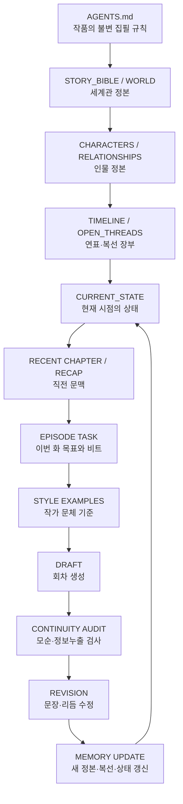
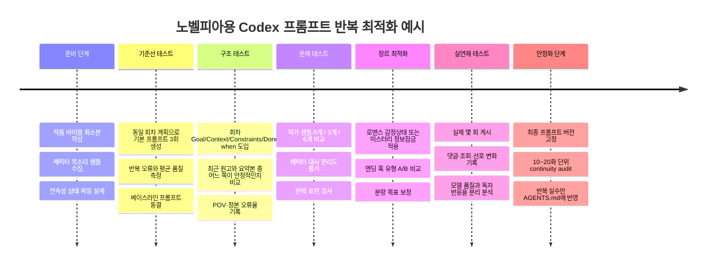

# 노벨피아 연재용 OpenAI Codex 소설 프롬프트 최적화 연구

## 경영진 요약

이 보고서의 결론은 단순하다. **노벨피아 장편 연재를 Codex에 맡길 때 가장 좋은 프롬프트는 “한 번에 모든 설정과 이전 원고를 밀어 넣는 거대한 프롬프트”가 아니라, 작품을 하나의 장기 프로젝트처럼 관리하는 ‘계층형 프롬프트 + 외부 연속성 메모리 + 회차별 작업지시서’ 구조**다. Codex 자체가 본래 소설 전용 생성기가 아니라 저장소·파일·지시문을 읽고 장기간 작업하는 코딩 에이전트이기 때문에, 오히려 이 구조를 역이용하면 일반 채팅형 LLM보다 **설정집, 등장인물표, 미회수 복선, 최근 회차, 문체 샘플을 파일 단위로 지속 관리하는 연재 파이프라인**을 만들기 좋다. OpenAI도 Codex에 대해 `AGENTS.md`를 지속적 지침으로 사용하고, 장기 작업에서는 사양·계획·제약·상태를 Markdown 파일로 외부화해 “durable project memory”를 만드는 방식을 권장한다. citeturn17view0turn18view0turn18view1

따라서 권장 구조는 다음과 같다.

> **불변 규칙 → 작품 바이블 → 캐릭터/연표/복선 장부 → 최근 연속성 요약 → 해당 회차 목표 → 문체 샘플 → 출력 계약 → 작성 후 연속성 메모리 갱신**

OpenAI의 Codex 프롬프트 가이드는 작업 지시를 **Goal / Context / Constraints / Done when**으로 명시하는 방식을 기본값으로 제시한다. 소설에 번역하면 각각 **이번 화의 서사 목적 / 읽어야 할 설정과 이전 화 / 절대 위반할 수 없는 설정·문체·POV / 완성 판정 기준**이 된다. citeturn17view0

노벨피아 쪽에서는 **플러스 전환의 현재 공식 안내에 회차당 공백 미포함 3,000자 이상, 프롤로그를 제외한 15화 이상 연재 등의 조건이 제시**되어 있으며, 2025 공모전 역시 회당 공백 미포함 3,000자를 요구했다. 노벨피아는 자체 글자 수 계산에서 띄어쓰기뿐 아니라 마침표·따옴표·개행·탭·느낌표·물음표 등 여러 문자를 제외한다고 공식 FAQ에 명시한다. 따라서 프롬프트에 단순히 “4,000자 써라”라고 쓰는 것보다 **“노벨피아 집계 방식 기준 최소 3,000자를 확실히 넘기도록 작성하고, 초안에서는 안전 마진을 둔다”**고 지시해야 한다. citeturn22search3turn22search5turn22search0turn19view0

본 보고서의 실무 권장값은 **노벨피아 집계 기준 약 3,300~4,200자**를 기본 회차 목표로 잡고, 특별한 전투·결전·감정 절정 회차만 더 길게 허용하는 것이다. 이는 노벨피아의 공식 “평균 권장 길이”가 아니라, 3,000자 플러스 기준을 안정적으로 넘기면서 연재 생산성을 유지하기 위한 **운영상 안전 마진**이다. 정확한 길이는 실제 작품의 독자 반응을 기준으로 다시 보정해야 한다. citeturn22search3turn19view0

노벨피아의 2026년 8월 현재 TOP100과 플러스 작품 목록을 보면 제목과 태그에서 `회귀`, `빙의`, `아카데미`, `이세계`, `집착`, `SSS/S급·재앙급`, `버튜버`, `게임/갤러리`, `로판`, `TS`, `백합`, `먼치킨`, `착각`, `하렘`, `순애` 등이 반복적으로 관찰된다. “~가 되었다”, “~에게 집착당한다” 같은 콘셉트 즉시 전달형 제목도 많다. 다만 이것은 **현재 차트에서 관찰되는 상업적 어휘 패턴**이지, “노벨피아 독자는 모두 특정 성별·연령이고 반드시 이 소재를 좋아한다”는 인구통계적 결론은 아니다. 공개적으로 검증 가능한 최신 노벨피아 자체 독자 인구통계가 충분하지 않으므로, 프롬프트는 **트렌드를 신호로만 사용하고 작품의 고유 훅을 별도로 보존**해야 한다. citeturn18view2turn18view3turn19view1

웹소설에 관한 국내 연구·산업 분석에서는 모바일 소비와 짧은 독서 호흡, 빠른 전개와 가독성, 독자 댓글·조회 수에 기반한 피드백 루프가 중요한 특성으로 지적된다. 별도의 문피아 연구에서는 잦은 연재와 연독률 사이의 긍정적 관계가 관찰됐지만, 이는 노벨피아 데이터가 아니므로 “노벨피아에서도 반드시 매일 연재해야 한다”는 법칙으로 확대해서는 안 된다. 대신 **Codex 사용의 핵심 장점은 작가가 감당 가능한 연재 빈도를 유지하면서 회차 간 품질 저하를 줄이는 것**으로 잡는 편이 타당하다. citeturn19view5turn19view4

가장 중요한 실무 원칙을 압축하면 다음과 같다.

| 항목 | 권장 결론 |
|---|---|
| Codex 용도 | 완전 자동 소설가보다 **저장소 기반 공동작가·초안/수정 에이전트**로 사용 |
| 기본 형식 | Markdown 파일 + `AGENTS.md` + 작품 바이블 + 회차 작업지시 |
| 회차 입력 | 전체 과거 원고가 아니라 **정본 설정 + 최근 관련 사실 + 직전 회차 + 이번 화 목표** |
| 회차 분량 | 노벨피아 집계 최소 3,000자 기준을 고려해 **약 3,300~4,200자 목표**를 실험값으로 권장 |
| 창작 제어 | 온도보다 먼저 **구체적인 장면 목표·금지사항·문체 샘플·연속성 장부**를 조정 |
| 샘플링 | Codex 앱/CLI의 소설용 `temperature/top_p/stop` 권장치는 공식적으로 확인되지 않음. API에서 지원될 때만 실험 |
| 연속성 | 매 화 뒤 `CONTINUITY.md` 또는 구조화된 상태 파일을 갱신 |
| 속도 모드 | 최소 설정 + 직전 1~2화 요약 + 장면 비트 중심 |
| 고품질 모드 | 문체 샘플 + 감정선 + 서브텍스트 + 2단계 수정 |
| 미스터리 | “모델이 알아도 화자·독자가 아직 모르는 정보”를 별도 잠금 |
| 장기 연재 | 10~20화마다 **바이블 압축·모순 감사·미회수 복선 감사** 실시 |
| 노벨피아 최적화 | 초반 훅, 회차 내 보상, 끝단 추진력을 **매 화 체크하되 기계적 절벽엔딩은 금지** |

핵심적으로, **좋은 프롬프트란 길이가 긴 프롬프트가 아니라 “어떤 정보가 불변이고, 어떤 정보가 현재 상태이며, 이번 화에서 무엇을 변화시켜야 하는지”를 모델이 구별할 수 있는 프롬프트**다.

## Codex를 장편소설 집필기에 사용할 때의 기술적 전제

OpenAI가 현재 문서에서 설명하는 Codex는 기본적으로 **에이전트형 코딩 모델 및 코딩 환경**이다. GPT-5.3-Codex 모델 페이지도 이를 “agentic coding tasks”에 최적화된 모델로 설명한다. 따라서 “소설 전용 Codex 입력 규격”이나 “노벨피아 소설을 위한 공식 프롬프트 형식”은 존재하지 않는다. 소설 집필은 Codex의 파일 읽기·수정·장기 프로젝트 유지 기능을 창작 워크플로에 전용하는 사용법으로 보는 것이 정확하다. citeturn20view0turn17view0

**입력 형식은 Markdown 중심이 가장 합리적이다.** Codex는 `AGENTS.md`를 작업 전 읽으며, 프로젝트 루트에서 현재 디렉터리까지 지침을 계층적으로 합친다. 더 가까운 디렉터리의 지침이 뒤에 추가되어 앞선 지침을 덮어쓸 수 있고, 프로젝트 지침 파일의 합산 기본 상한은 `project_doc_max_bytes` 32 KiB로 문서화돼 있다. 그러므로 세계관 전체를 `AGENTS.md` 한 파일에 몰아넣는 것이 아니라, `AGENTS.md`에는 **짧고 불변적인 집필 원칙만** 놓고 세부 설정은 별도 파일로 분리해야 한다. citeturn18view0

권장 디렉터리 예시는 다음과 같다.

```text
my_novel/
├─ AGENTS.md
├─ README.md
│
├─ canon/
│  ├─ STORY_BIBLE.md
│  ├─ WORLD.md
│  ├─ CHARACTERS.md
│  ├─ TIMELINE.md
│  ├─ RELATIONSHIPS.md
│  └─ MYSTERY_LEDGER.md
│
├─ style/
│  ├─ STYLE_GUIDE.md
│  ├─ GOOD_EXAMPLES.md
│  └─ FORBIDDEN_PATTERNS.md
│
├─ continuity/
│  ├─ CURRENT_STATE.yaml
│  ├─ OPEN_THREADS.md
│  ├─ RECAP_RECENT.md
│  └─ CANON_CHANGELOG.md
│
├─ plans/
│  ├─ ARC_PLAN.md
│  ├─ EPISODE_PLAN.md
│  └─ EP_041_TASK.md
│
├─ chapters/
│  ├─ EP_039.md
│  ├─ EP_040.md
│  └─ EP_041.md
│
└─ prompts/
   ├─ DRAFT.md
   ├─ CONTINUITY_CHECK.md
   └─ REVISION.md
```

이것은 OpenAI가 장기 Codex 작업에서 사양·계획·상태·제약을 Markdown으로 외부화하는 “durable project memory” 접근을 소설 제작에 대응시킨 설계다. OpenAI의 장기 작업 예에서도 `Prompt.md`, `Plan.md`, 실행 지침과 상태 문서를 별도로 유지함으로써 장시간 작업 중 목표 이탈을 줄였다. citeturn18view1

**회차마다 Codex에 주는 직접 명령은 짧아져야 한다.** OpenAI가 권하는 네 가지 요소를 소설에 매핑하면 다음과 같다. citeturn17view0

```text
[Goal]
EP.041의 초안을 작성한다.
이번 화의 핵심 변화는 "주인공이 세린을 처음으로 의심하기 시작한다"이다.

[Context]
먼저 다음 파일을 읽는다.
- AGENTS.md
- canon/STORY_BIBLE.md
- canon/CHARACTERS.md
- continuity/CURRENT_STATE.yaml
- continuity/OPEN_THREADS.md
- chapters/EP_040.md
- plans/EP_041_TASK.md
- style/GOOD_EXAMPLES.md

[Constraints]
- 새 세계관 사실을 임의로 확정하지 않는다.
- 주인공 1인칭 제한시점을 유지한다.
- 세린이 범인임을 독자에게 확정시키지 않는다.
- 캐릭터가 알 수 없는 정보는 서술하지 않는다.
- 노벨피아 집계 기준 3,300~4,200자를 목표로 한다.

[Done when]
- EP_041.md가 완성되어 있다.
- 이번 화 목표가 달성돼 있다.
- 기존 설정과 충돌하지 않는다.
- 마지막 10~15%에 다음 화로 이어지는 구체적 질문이 남는다.
- CONTINUITY 업데이트용 변경사항을 별도로 정리한다.
```

이 방식의 장점은 “판타지 소설을 재미있게 써줘” 같은 추상 지시를 **검증 가능한 완료 조건**으로 바꾼다는 것이다. OpenAI 역시 복잡한 Codex 작업은 먼저 계획하고, 명확한 검증 조건을 두는 방식을 권장한다. citeturn17view0turn18view1

**토큰 한도는 ‘Codex 전체에 하나의 고정값’이라고 가정하면 안 된다.** 사용자가 요청한 전제대로 이 보고서에서는 정확한 Codex API 한도와 가격을 **미지정**으로 취급한다. 참고로 2026년 8월 현재 공개된 GPT-5.3-Codex 모델 페이지에는 해당 특정 모델에 대해 400,000 context window와 128,000 max output tokens가 표기돼 있으나, 이는 그 모델의 API 사양이지 모든 Codex 클라이언트·플랜·향후 모델의 보장값이 아니다. 사용량 제한 역시 계층과 환경에 따라 달라질 수 있다. 따라서 소설 프로젝트를 최대 컨텍스트 크기에 맞춰 설계해서는 안 된다. citeturn20view0

실전에서는 오히려 다음과 같은 **입력 예산**을 권한다. 이는 OpenAI 공식 제한이 아니라 본 연구의 소설용 설계값이다.

| 입력 구성 | 권장 예산 | 역할 |
|---|---:|---|
| 불변 집필 규칙 | 500~1,500 tokens | POV, 금지사항, 문체 원칙 |
| 압축 세계관/캐릭터 정본 | 3,000~8,000 | 현재 회차에 필요한 설정 |
| 현재 상태·복선 | 1,000~3,000 | 연속성 |
| 직전 회차 또는 최근 요약 | 2,000~6,000 | 국소 문맥 |
| 문체 예시 | 1,000~3,000 | 작가 고유 리듬 |
| 이번 화 작업지시 | 500~1,500 | 실제 목표 |
| **일반적인 총량** | **약 8,000~22,000** | 대부분의 한 화 작업에 충분한 출발점 |

한국어 글자 수와 토큰 수는 일대일 대응하지 않는다. OpenAI도 토큰이 언어에 따라 문자·단어와 서로 다른 방식으로 대응한다고 설명하기 때문에, 노벨피아의 “3,000자”를 곧바로 “3,000 tokens”라고 계산해서는 안 된다. citeturn21search6

**Temperature, top-p, stop sequence에 대해서는 Codex와 API를 구분해야 한다.** 현재 Codex 앱·CLI의 공식 소설 작성 문서에서 “소설이면 temperature를 X로 설정하라” 같은 권장값은 확인되지 않는다. 반면 OpenAI API의 일반 샘플링 인터페이스에는 `temperature`와 `top_p` 개념이 존재하고, Chat Completions 문서는 둘 중 하나를 조정하고 양쪽을 동시에 조절하지 않는 방식을 일반적으로 권한다. 따라서 아래 값들은 **해당 모델·엔드포인트가 실제로 파라미터를 허용할 때만 쓰는 실험 시작점**이며 Codex 공식 권장치가 아니다. citeturn21search1turn21search2

| 작업 | Temperature 실험 시작점 | Top-p | 해석 |
|---|---:|---:|---|
| 빠른 아이디어 발산 | 0.8~1.0 | 기본값 유지 | 변주 확대 |
| 일반 회차 초안 | 0.65~0.85 | 기본값 유지 | 창의성/안정성 균형 |
| 고정 캐릭터 대화 | 0.45~0.7 | 기본값 유지 | 목소리 일탈 감소 |
| 설정 정합성 작업 | 0.2~0.5 | 기본값 유지 | 사실 보존 우선 |
| 미스터리 복선 검사 | 0.2~0.45 | 기본값 유지 | 정보 누출 억제 |
| 문장 리라이팅 | 0.4~0.7 | 기본값 유지 | 원뜻 유지 + 표현 변화 |

API가 `top_p`만 제어하는 환경이라면 temperature는 건드리지 않고 top-p를 실험한다. 반대로 temperature를 실험하는 동안 top-p는 기본값에 고정하는 편이 A/B 테스트 해석도 쉽다. OpenAI API 문서도 `temperature`와 `top_p`를 대체적 샘플링 제어로 설명한다. citeturn21search2

현재 Codex 모델 문서에서 소설 작성과 더 직접적으로 연관된 조절점은 **reasoning effort**다. GPT-5.3-Codex의 경우 `low`, `medium`, `high`, `xhigh`가 문서화되어 있고, Codex Best Practices도 짧고 명확한 작업은 낮은 추론 수준, 복잡한 작업은 중·고 수준을 시험하라고 권한다. 소설에 적용하면 “한 장면 초안”은 low/medium, “30화 분량 모순 검사”, “미스터리 단서 검증”, “아크 재설계”는 high 이상을 비교 실험할 가치가 있다. citeturn20view0turn17view0

**Stop sequence 역시 Codex 앱 자체의 보편적 소설 옵션으로 간주해서는 안 된다.** OpenAI의 일반 API 운영 가이드에서는 불필요한 생성을 막는 방법으로 stop sequence를 설명한다. 지원되는 API를 직접 사용할 경우 `<END_EPISODE>` 같은 희귀한 마커를 사용할 수 있지만, Codex가 파일을 작성하는 작업에서는 실제 stop parameter보다 “본문은 여기까지, 후기·해설·자기평가는 파일에 넣지 말 것”이라고 출력 계약을 명시하는 편이 관리하기 쉽다. citeturn20view5

예를 들어 API에서 stop이 지원될 때는 다음처럼 설계할 수 있다.

```text
본문의 마지막에 정확히 다음 마커를 출력한다.

<END_EPISODE>

마커 뒤에는 어떠한 해설, 요약, 다음 화 예고도 작성하지 않는다.
```

다만 자연스러운 소설 본문에 나올 수 있는 `끝`, `###`, `다음` 같은 흔한 문자열은 stop으로 삼지 않는 편이 안전하다.

프롬프트 엔지니어링 자체에서는 **단순·직접적인 지시, Markdown/XML 구획, 명시적인 성공 기준, 필요할 때만 few-shot 예시를 넣는 방식**이 현재 OpenAI의 권장 방향이다. 특히 reasoning 모델에 “단계별로 생각해라”라고 장황하게 요구하는 것보다, 결과물과 제약을 정확히 쓰는 편이 낫다고 문서화돼 있다. citeturn20view1turn20view2

API를 사용한다면 프롬프트의 순서도 중요하다. OpenAI의 Prompt Caching 문서는 **불변 instructions/examples를 앞쪽에, 매 호출마다 달라지는 데이터를 뒤쪽에 놓으라**고 권한다. 장편소설에서는 곧 `STYLE_GUIDE + 핵심 규칙 → 작품 정본 → 이번 회차 상태/목표` 순서가 된다. 이는 캐시 효율뿐 아니라 사람이 프롬프트 버전을 관리하기도 편하다. citeturn20view3

권장 계층을 도식화하면 다음과 같다.



이 구조는 Codex가 장기 작업의 상태를 파일로 외부화했을 때 드리프트를 줄일 수 있다는 OpenAI의 장기 작업 권고를 창작 시스템으로 변환한 것이다. citeturn18view1

## 노벨피아 독서·연재 문법을 프롬프트에 반영하는 법

노벨피아에서는 우선 **회차 분량을 모델이 아니라 플랫폼 기준으로 정의해야 한다.** 공식 FAQ에 따르면 노벨피아 글자 수 계산은 띄어쓰기·마침표·따옴표·개행·탭·느낌표·물음표 등을 포함하지 않는다. 현재 2026년 신규 작가 챌린지 안내에서도 플러스 연재 신청 조건 중 하나로 “노벨피아 사이트 기준 편당 공백 미포함 3,000자 이상”이 제시되고, 2025년 공식 FAQ 역시 플러스 전환 조건을 회차 15회 이상·회차당 공백 미포함 3,000자 이상이라고 설명한다. citeturn19view0turn22search3turn22search5

따라서 아래처럼 쓰는 것이 좋다.

```text
[분량]
- 플랫폼: 노벨피아
- 노벨피아 집계 기준 3,300~4,200자를 목표로 한다.
- 3,000자를 간신히 넘기는 것을 목표로 하지 말고 안전 마진을 둔다.
- 단, 장면을 억지로 늘리기 위한 반복 설명·감정 재진술·대사 반복은 금지한다.
- 실제 게시 전 별도의 글자 수 검사를 거친다.
```

특히 “공백 포함 5,000자” 같은 요구보다 이 방식이 낫다. 노벨피아 자체 계산 규칙과 저자가 워드프로세서에서 보는 문자 수가 다를 수 있기 때문이다. citeturn19view0

**호흡은 ‘한 화가 전체 소설의 일부’이면서 동시에 ‘오늘 결제·클릭해 읽은 하나의 경험’이어야 한다.** 국내 소프트웨어정책연구소의 웹소설 산업 분석은 웹소설의 가독성, 짧은 호흡, 빠른 장면 전환, 대화체·단문, 독자 피드백을 특징으로 언급한다. 따라서 Codex가 전통 장편소설처럼 한 화를 전부 배경설명이나 이동 장면에 쓰지 않도록 회차별 변화를 명시하는 것이 중요하다. citeturn19view5

본 보고서가 권하는 회차 구조는 다음과 같다.

| 회차 구간 | 기능 | 프롬프트 질문 |
|---|---|---|
| 첫 5~10% | 재진입 훅 | 독자가 직전 화의 긴장을 즉시 떠올릴 사건·감정·질문이 있는가? |
| 10~30% | 이번 화 욕망/문제 명시 | 주인공이 “지금 당장” 원하는 것은 무엇인가? |
| 30~70% | 압력 상승 | 선택·대가·정보·관계 중 최소 하나가 변하는가? |
| 70~90% | 부분 보상 | 한 가지 기대를 실제로 충족하는가? |
| 마지막 10~15% | 다음 화 추진력 | 새 질문·위험·결심·발견이 생기는가? |

비율은 플랫폼 공식 규정이 아니라 **모델이 서사의 기능을 분배하도록 하기 위한 작가용 휴리스틱**이다. 중요한 것은 모든 화를 동일한 공식으로 만드는 것이 아니라, “이번 화에는 무엇이 실제로 변했는가?”를 모델에 강제로 묻는 것이다.

특히 “클리프행어”를 **무조건 문이 벌컥 열리거나 누군가 이름을 부르는 장면으로 끝내라**고 프롬프트하면 몇 화만 지나도 AI 냄새가 강해진다. 대신 끝단 훅을 다섯 종류로 돌리는 편이 낫다.

> **정보형**: 믿고 있던 사실의 일부가 틀렸음을 발견  
> **결심형**: 주인공이 되돌리기 어려운 선택을 함  
> **위험형**: 다음 화에 즉시 해결해야 할 위협 발생  
> **관계형**: 인물 간 의미가 바뀌는 말·행동 발생  
> **약속형**: 독자가 기다리던 대결·데이트·시험·폭로가 바로 다음 단계로 확정

이 분류는 프롬프트 설계용 제안이며, 플랫폼 규칙이 아니다.

**현재 노벨피아의 상위권 제목과 태그는 콘셉트 전달 속도가 매우 빠르다.** 2026년 8월 현재 TOP100에는 회귀·TS·버튜버·로판·아카데미·SSS급·집착·이세계·게임·갤러리 등이 명시된 제목들이 다수 보이며, 플러스 목록에서도 `#판타지 #라이트노벨 #중세 #하렘 #로맨스판타지 #회귀`, `#전생 #집착 #먼치킨 #착각`, `#순애 #아카데미 #피폐`처럼 다중 태그 조합을 적극적으로 사용한다. citeturn18view2turn18view3turn19view1

그러므로 프롬프트의 메타데이터는 “장르: 판타지” 한 줄로 끝내지 말고 최소 다음 세 층으로 나누는 것이 효과적이다.

```yaml
genre:
  primary: 판타지
  secondary: 라이트노벨 / 로맨스

commercial_hooks:
  - 아카데미
  - 빙의
  - 착각
  - 순애

emotional_promises:
  - 주인공은 강하지만 인간관계에는 서툴다
  - 히로인의 신뢰가 천천히 쌓인다
  - 사이다는 전투보다 능력 인정에서 온다

avoid:
  - 무의미한 하렘 확대
  - 이유 없는 집착
  - 상태창 남발
```

여기서 매우 중요한 것은 **태그를 설정으로 착각하지 않는 것**이다. `#집착`을 넣었다고 모델에게 “히로인들이 집착한다”만 알려주면 모든 인물이 같은 방식으로 질투·소유욕을 표현하기 쉽다. 대신 “왜 집착하는가, 어떻게 표현하는가, 선을 어디까지 넘는가, 주인공은 그것을 어떻게 받아들이는가”를 개별 캐릭터 파일에서 정의해야 한다.

예를 들면:

```text
[집착 표현 차별화]
세린:
- 근원: 버려짐에 대한 공포
- 표현: 상대의 일정을 기억하고 먼저 도움을 준비한다
- 하지 않는 것: 공개적인 질투 폭발, 물리적 감금
- 위험선: 상대가 떠날 가능성이 커질수록 정보를 숨긴다

유리아:
- 근원: 경쟁심과 인정욕구
- 표현: 다른 사람 앞에서 주인공의 유능함을 자기 방식으로 과시한다
- 하지 않는 것: 울며 매달리는 행동
- 위험선: 중요한 결투에 독단적으로 개입한다
```

이 방식은 “트로프는 익숙하게, 캐릭터 구현은 고유하게”라는 방향을 만든다.

**노벨피아 독자층을 단일 인구통계로 프롬프트에 박아 넣는 것은 권하지 않는다.** 이번 조사에서 현재의 검증 가능한 공식 독자 성별·연령 분포를 충분히 확보하지 못했으며, 노벨피아에는 판타지·로맨스·라이트노벨뿐 아니라 다양한 소재와 관계 중심 작품이 함께 노출된다. 현재 TOP100에서도 백합, 로판, TS, 스포츠, 대체역사, 게임, 버튜버 등 상당히 이질적인 작품이 동시에 나타난다. 따라서 “20대 남성 취향으로 써라”처럼 추정된 독자를 모델에 고정하는 것보다 **실제 작품의 타깃 독자 프로필을 저자가 직접 정의**하는 편이 정확하다. citeturn18view2turn18view3

권장 독자 정의는 이렇다.

```text
[타깃 독자]
- 플랫폼: 노벨피아
- 핵심 독자: 아카데미 판타지를 이미 많이 읽은 독자
- 이미 알고 있다고 가정해도 되는 문법: 빙의, 엑스트라, 아카데미, 마나
- 다시 길게 설명하지 말 것: 상태창의 일반 원리, 아카데미 입학 클리셰
- 이 작품에서 새롭게 느껴져야 하는 것:
  1. 주인공이 미래를 "대략" 알지만 정확한 사건 순서는 모른다.
  2. 히로인은 공략 대상이 아니라 주인공의 미래 지식을 의심한다.
  3. 전투보다 정보 비대칭이 주요 긴장이다.
- 독자에게 약속하는 감정: 유능함 + 불안 + 천천히 쌓이는 신뢰
```

**연재 주기는 프롬프트 설계와 직접 연결된다.** 문피아 작품을 대상으로 한 연구에서는 주 7회 이상의 높은 연재 빈도가 구독·연독률과 긍정적으로 관련되고 휴재가 독자 이탈과 연관된다는 결과가 나왔다. 노벨피아 자체 데이터는 아니므로 그대로 수치 규칙으로 옮길 수 없지만, 웹소설 제작에서 “한 번의 대작 초안”보다 **지속 가능한 회차 생산 시스템**을 만드는 것이 중요한 이유를 뒷받침한다. citeturn19view4

Codex에 가장 적합한 목표는 따라서:

> **“평균 95점짜리 한 화를 AI가 완성”이 아니라 “작가가 주 4~7회의 일정 속에서도 설정 모순·초안 지연·리라이팅 부담을 줄이며 꾸준히 80~90점 이상의 회차를 내게 하는 시스템”**

이다.

또한 웹소설 제작에서는 댓글과 조회 수를 다음 회차 기획의 피드백으로 이용하는 관행이 연구기관 자료에서도 언급된다. 그러므로 노벨피아 연재 후 반응을 Codex에게 그대로 “독자들이 싫어했으니 다 바꿔”라고 넣기보다, **댓글에서 반복되는 신호와 소수 강성 의견을 분리하는 분석 단계**가 필요하다. citeturn19view5

마지막으로 AI 활용 시에는 **저작권·플랫폼 규정 확인을 별도 절차로 두는 것이 안전하다.** 노벨피아 공식 공모전 규정은 표절·각색·개작 등 타인의 지식재산권을 침해하는 작품을 제외한다고 명시한다. 이번 조사에서는 “일반 연재 본문의 생성형 AI 사용”을 포괄적으로 규정하는 최신 공식 문구를 충분히 확인하지 못했으므로, 공모전·이벤트·계약 참여 시에는 해당 시점의 작가센터·이용약관·개별 모집요강을 별도로 확인해야 한다. citeturn19view3

## 권장 프로젝트 구조와 모듈형 마스터 프롬프트

Codex에 가장 먼저 만들어 둘 파일은 장대한 설정집이 아니라 **짧은 `AGENTS.md`**다. OpenAI 문서상 이 파일은 Codex가 작업 전 읽는 지속적 지침이므로, 자주 변하는 줄거리보다 “절대 바뀌면 안 되는 집필 프로토콜”을 넣어야 한다. citeturn18view0

권장 예시는 다음과 같다.

```markdown
# AGENTS.md

## 역할
이 저장소는 한국어 웹소설 장기 연재 프로젝트다.
주요 게시 플랫폼은 노벨피아다.
너는 작가를 대체하는 자동 소설가가 아니라,
정본을 준수하는 공동 집필·편집 에이전트로 행동한다.

## 정본 우선순위
충돌이 있을 경우 다음 우선순위를 따른다.

1. 이 파일의 불변 규칙
2. canon/ 아래 정본
3. continuity/CURRENT_STATE.yaml
4. 해당 화의 plans/EP_XXX_TASK.md
5. 최근 완성 원고
6. 모델의 추론

모르는 사실은 기존 세계관 사실인 것처럼 확정하지 않는다.

## 집필 원칙
- 기본 언어: 자연스러운 현대 한국어.
- 지정된 POV와 시제를 유지한다.
- 인물은 자신이 알 수 있는 정보만 알고 행동한다.
- 설정 설명은 현재 갈등에 필요한 만큼만 노출한다.
- 감정은 같은 의미를 서술·독백·대사로 세 번 반복하지 않는다.
- 대사는 인물별 어휘·문장 길이·회피 방식이 달라야 한다.
- 상투적인 AI 연결어와 과도한 비유를 반복하지 않는다.
- 독자를 위해 이미 명확한 사실을 다시 설명하지 않는다.

## 노벨피아 회차 원칙
- 매 화 최소 하나의 상태 변화가 있어야 한다.
- 매 화 최소 하나의 독자 보상이 있어야 한다.
- 끝부분에는 다음 화를 읽을 이유가 있어야 하지만
  억지스러운 절벽 엔딩을 강제하지 않는다.
- 목표 분량은 해당 회차 작업지시 파일을 따른다.

## 연속성
초안 전 관련 canon과 continuity 파일을 먼저 읽는다.
초안에서 새로 생긴 정본 사실을 임의로 기존 canon에 덮어쓰지 않는다.
초안 후 변경 후보를 별도로 보고한다.

## 출력
원고 파일에는 소설 본문만 쓴다.
분석, 자기평가, 작성 후기, 체크리스트는 원고에 섞지 않는다.
```

OpenAI는 `AGENTS.md`를 지나치게 비대하게 만들기보다 재사용 가능한 실용 지침을 두고, 더 자세한 내용은 관련 파일로 연결하는 방향을 권장한다. 프로젝트 지침에는 기본 크기 제한도 있기 때문에 이 분리가 중요하다. citeturn17view0turn18view0

그 위에 **모듈형 마스터 프롬프트**를 다음처럼 구축할 수 있다. 아래 템플릿의 모든 칸을 매번 채울 필요는 없다. “이번 화 생성에 필요한 정보만 활성화한다”는 원칙이 핵심이다.

```markdown
# ROLE / 역할

당신은 한국어 상업 웹소설 전문 공동작가다.
게시 플랫폼은 노벨피아다.
작가가 제공한 정본과 연속성을 최우선으로 하며,
이번 회차의 초안을 작성한다.

작가가 명시하지 않은 세계관 사실을 임의로 정본화하지 않는다.
모호한 부분을 채워야 한다면 기존 설정과 충돌하지 않는
최소한의 가정을 사용하되, 새 정본 후보로 별도 표시한다.


# METADATA / 작품 메타데이터

작품명:
플랫폼: 노벨피아
메인 장르:
서브 장르:
핵심 태그:
독자에게 약속하는 감정:
핵심 한 줄 콘셉트:
현재 아크:
현재 회차:
예상 전체 길이:

타깃 독자:
- 이미 익숙하다고 가정할 장르 문법:
- 이 작품에서 기대하는 차별점:
- 절대 배신하면 안 되는 장르 약속:


# WORLDBUILDING / 세계관

시대·공간:
사회 구조:
권력 구조:
마법/능력/기술 체계:
경제적 규칙:
중요 기관:
현재 공개된 세계관 사실:
독자에게 아직 비공개인 사실:

[하드 룰]
1.
2.
3.

[이번 화에 필요한 설정만]
- 
- 

[이번 화에서 설명하지 말 것]
- 
- 


# CHARACTER PROFILES / 캐릭터 프로필

## 주인공
이름:
나이:
현재 목표:
장기 목표:
가장 큰 욕망:
가장 큰 두려움:
잘못 믿고 있는 것:
현재 알고 있는 사실:
현재 모르는 사실:
말투:
행동 습관:
타인을 바라보는 방식:
이번 화 시작 감정:
이번 화 종료 감정:

## 주요 인물 A
이름:
주인공과 관계:
자기 목표:
주인공에게 숨기는 것:
현재 알고 있는 것:
말투:
갈등 방식:
호감/혐오 표현법:

## 주요 인물 B
...


# CONTINUITY MEMORY / 연속성 메모리

[현재 시간]
날짜/시각:
현재 위치:

[물리 상태]
- 주인공:
- A:
- B:

[소지품]
- 

[관계 상태]
- 주인공 ↔ A:
- 주인공 ↔ B:

[최근 확정 사실]
- 

[미회수 복선]
THREAD-01:
THREAD-02:

[독자가 알고 있는 것]
- 

[주인공이 알고 있는 것]
- 

[독자도 주인공도 모르는 작가 비밀]
- 

[절대 모순을 내면 안 되는 사실]
- 


# CHAPTER GOALS / 이번 회차 목표

이번 화의 한 문장 목적:
"________________________________"

이번 화에서 반드시 변해야 하는 것:
- 

주인공의 즉시 목표:
- 

방해 요소:
- 

핵심 장면:
1.
2.
3.

독자 보상:
- 

새로 심을 복선:
- 

이번 화에서 회수할 복선:
- 

이번 화에서 공개 가능한 정보:
- 

아직 공개하면 안 되는 정보:
- 

종료 시 남길 질문:
- 


# BEAT PLAN / 장면 비트

Beat A — 오프닝
목적:
갈등:
종료 변화:

Beat B — 압력 상승
목적:
갈등:
종료 변화:

Beat C — 핵심 보상/반전
목적:
갈등:
종료 변화:

Beat D — 엔딩
목적:
다음 화 추진력:


# STYLE & TONE / 문체와 톤

시점:
시제:
서술 거리:
문장 길이:
대사 비율:
독백 밀도:
유머 강도:
감정 표현 강도:
잔혹성:
로맨스 농도:
설명 밀도:

문체 원칙:
- 짧은 단락을 기본으로 하되 기계적으로 한 문장씩 끊지 않는다.
- 추상적인 감정 이름보다 행동·선택·반응을 우선한다.
- 같은 감정을 다른 표현으로 반복 설명하지 않는다.
- 비유는 장면당 필요한 만큼만 사용한다.
- 긴박한 장면에서는 설명보다 감각과 행동을 앞세운다.

피할 표현:
- "알 수 없는 감정이"
- "무언가가 달라졌다"
- "그 순간이었다"
등 작가가 반복을 싫어하는 표현을 추가한다.


# CONSTRAINTS / 제약

[하드 제약]
- POV 이탈 금지.
- 정본 설정 변경 금지.
- 알 수 없는 정보 인지 금지.
- 새 능력 즉흥 추가 금지.
- 캐릭터 성격을 장면 편의를 위해 변경 금지.
- 원작·타 작가의 특정 문체 모사 금지.

[플랫폼 제약]
- 노벨피아 게시용.
- 목표 분량: 노벨피아 집계 기준 ______자.
- 모바일에서 읽기 쉬운 단락 구성.
- 한 화 안에서 최소 한 가지 실질적 보상을 제공.

[서사 제약]
- 이번 화에서 해결하면 안 되는 문제:
- 이번 화에서 반드시 해결할 문제:
- 죽이면 안 되는 인물:
- 등장시키면 안 되는 인물:


# EXAMPLES / 예시

아래 예시는 "사실"이 아니라 문체·대화 리듬의 기준이다.

[좋은 서술 예시]
"""
작가 본인의 기존 원고 2~5문단
"""

좋은 이유:
- 설명보다 장면이 먼저 진행됨
- 주인공의 건조한 자기합리화가 드러남
- 대사가 짧고 숨은 의도가 있음

[좋은 대화 예시]
"""
작가 본인의 기존 대화
"""

[피해야 할 예시]
"""
작가가 싫어하는 AI식 문단
"""

피해야 할 이유:
- 감정 중복
- 과한 추상어
- 인물 목소리 동일화


# OUTPUT CONTRACT / 출력 계약

다음 순서로 작업한다.

A. 내부적으로 설정·연속성을 확인한다.
B. 소설 본문 초안을 작성한다.
C. 본문에는 분석이나 체크리스트를 넣지 않는다.
D. 완성 후 별도 보고에서 다음만 작성한다.

- 예상 분량
- 이번 화에서 새로 생긴 정본 후보
- 관계 상태 변화
- 회수된 복선
- 새로 생긴 복선
- 다음 화가 반드시 기억해야 할 사실
- 발견된 잠재 모순

원고 파일:
chapters/EP_XXX.md

메모리 업데이트 후보:
continuity/EP_XXX_DELTA.yaml


# DONE WHEN / 완료 조건

다음을 모두 만족해야 완료다.

[ ] 첫 장면에서 상황 또는 욕망이 작동한다.
[ ] 이번 화의 핵심 변화가 실제 장면으로 일어났다.
[ ] 독자가 얻는 보상 하나 이상이 있다.
[ ] 캐릭터 지식 범위를 위반하지 않았다.
[ ] 기존 연표·부상·소지품·관계와 충돌하지 않는다.
[ ] 장면마다 목적이 있다.
[ ] 설명만 하는 긴 구간이 없다.
[ ] 결말에 다음 화의 구체적 추진력이 있다.
[ ] 같은 감정을 2~3회 반복 서술하지 않았다.
[ ] 저자의 문체 예시와 크게 어긋나지 않는다.
```

Few-shot 예시는 가능한 한 **타 작가 작품을 그대로 넣기보다 자신의 이미 출판·작성한 문단**을 넣는 것이 좋다. OpenAI 문서상 few-shot은 원하는 출력 패턴을 예시로 보여 모델을 유도하는 데 사용할 수 있으며, 서로 상충하는 예시는 오히려 성능을 해칠 수 있다. citeturn20view1turn20view2

특히 문체 예시는 “문체: 가볍고 재치 있게”보다 훨씬 강한 제어 수단이다. 단, 예시를 너무 많이 넣으면 모델이 현재 장면보다 과거 장면의 어휘와 상황을 모사하는 문제가 생길 수 있으므로 **대표 문단 3~8개 정도를 카테고리별로 선별**하는 방식을 권한다.

또한 설정 우선순위를 반드시 명시하는 것이 좋다.

```text
[정본 충돌 해결 규칙]

같은 사실에 서로 다른 버전이 있을 경우:

1. CANON_LOCKED 표시가 있는 사실
2. 가장 최근 CANON_CHANGELOG에서 승인된 사실
3. STORY_BIBLE
4. CURRENT_STATE
5. 완성·게시된 회차
6. 회차 계획
7. 초안
8. 모델의 추론

충돌이 해결되지 않으면:
임의로 선택하지 말고 초안에서 해당 사실을 명시하지 않는 방식으로 우회한다.
```

이 한 블록이 장기 연재에서 매우 중요하다. **LLM 연속성 오류의 핵심 원인은 “정보를 아예 못 보는 것”만이 아니라, 서로 다른 버전의 정보를 봤을 때 어느 쪽이 정본인지 모르는 것**이기 때문이다.

## 장르·목표별 프롬프트 변형과 비교

다음 다섯 변형은 동일한 마스터 구조를 기반으로 하지만, **모델에게 가장 강하게 최적화시킬 목표를 서로 다르게 둔다.** 여기서 입력 토큰 수치는 모델 한도가 아니라 프로젝트 운영용 대략적 예산이다.

| 변형 | 주 장르·목표 | 창의성 | 통제력 | 권장 입력 예산 | 초안 속도 | 핵심 리스크 |
|---|---|---:|---:|---:|---:|---|
| 로맨스 감정선형 | 로맨스, 고품질 문장 | 4/5 | 4/5 | 12K~20K | 보통 | 감정 과잉·반복 |
| 판타지 정본형 | 판타지, 엄격 연속성 | 3/5 | 5/5 | 15K~30K | 느림 | 설정 문서 과적재 |
| 이세계 속도형 | 라노벨/이세계, 빠른 초안 | 5/5 | 3/5 | 6K~12K | 매우 빠름 | 클리셰·캐릭터 평면화 |
| 미스터리 정보잠금형 | 미스터리/스릴러 | 2~3/5 | 5/5 | 12K~24K | 느림 | 범인·단서 조기 누출 |
| BL/GL 관계망형 | BL/GL, 관계·감정 연속성 | 4/5 | 4~5/5 | 10K~20K | 보통 | 관계 변화 과속 |

**토큰 예산이 많을수록 무조건 좋은 것은 아니다.** 필요한 관련 맥락을 제공하는 것이 중요하다는 것이 OpenAI의 기본 프롬프트 원칙이며, 장기 Codex 작업도 핵심 상태를 외부 파일에 저장해 다시 참조하는 접근을 강조한다. citeturn20view1turn18view1

**로맨스 — 고품질 문장·감정선 우선형**

```text
[ROLE]
당신은 한국어 상업 로맨스 웹소설 공동작가다.
사건을 빠르게 처리하는 것보다
두 인물 사이의 감정 변화가 "왜 일어났는지" 납득 가능하게 만드는 것이 우선이다.

[이번 화 최우선 목표]
A가 B에게 호감을 자각하는 것이 아니다.
A가 "B를 이전과 같은 범주로 볼 수 없게 되는 작은 변화"까지만 간다.

[감정 연속성]
A → B 현재:
- 표면: 귀찮은 동료
- 내부: 신뢰 45/100
- 끌림: 아직 스스로 부정
- 두려움: 의존하는 것을 싫어함

B → A 현재:
- 표면: 장난
- 내부: 이미 특별하게 취급
- 단, 직접 고백할 의도 없음

[작성 규칙]
- 감정을 직접 이름 붙이기 전에 행동으로 한 번 보여준다.
- 심장이 뛰었다, 얼굴이 붉었다 같은 자동 반응에 과의존하지 않는다.
- 매 장면마다 두 사람의 힘의 균형이 조금씩 움직인다.
- 대화에는 표면 의도와 실제 의도를 분리한다.
- 고백·키스 등 큰 보상을 서두르지 않는다.
- 이번 화의 보상은 "독자는 알아차리지만 인물은 완전히 자각하지 못하는 변화"다.

[문체]
상업 웹소설의 가독성을 유지하되
감정 절정에서는 평소보다 문장 리듬을 느리게 허용한다.

[완료 조건]
마지막 시점에서 A가 B를 대하는 행동 하나가
회차 시작 때라면 하지 않았을 행동이어야 한다.
```

이 버전에서는 temperature보다 **감정 상태 벡터와 “이번 화에 갈 수 있는 최대 단계”를 고정하는 것**이 핵심이다. LLM은 로맨스에서 관계를 너무 빨리 진전시키는 경향을 보이기 때문에 “고백하지 않는다”보다 “이번 화의 허용 변화량”을 정의하는 방식이 더 안정적이다.

**판타지 — 정본·연속성 엄격형**

```text
[ROLE]
당신은 장기 판타지 연재의 집필 에이전트이자 continuity editor다.
창의적인 새 설정 추가보다 기존 정본 준수가 우선이다.

[작업 전 반드시 읽을 파일]
AGENTS.md
canon/WORLD.md
canon/MAGIC_SYSTEM.md
canon/CHARACTERS.md
canon/TIMELINE.md
continuity/CURRENT_STATE.yaml
continuity/OPEN_THREADS.md
chapters/직전회차.md
plans/이번회차.md

[설정 생성 정책]
- 기존 규칙만으로 설명 가능한 사건에는 새 설정을 만들지 않는다.
- 새 고유명사, 조직, 마법 계통, 역사적 사건을 즉흥적으로 추가하지 않는다.
- 새로운 사실이 정말 필요하면 [CANON_CANDIDATE]로만 보고한다.
- 정본 승인 없이 다음 화에서 사실로 재사용하지 않는다.

[전투]
- 사용 가능한 기술은 캐릭터 파일에 명시된 것만.
- 마나/부상/무기 상태를 추적한다.
- 승패는 능력 수치뿐 아니라 지형·정보·선택의 결과여야 한다.

[이번 화]
핵심 목표:
필수 사건:
금지 사건:
회수할 복선 ID:
새 복선 최대 개수: 1

[완료 전 검사]
1. 시간선
2. 위치
3. 부상
4. 소지품
5. 사용 가능 능력
6. 캐릭터 지식
7. 관계 상태
8. 공개/비공개 정보
를 검사한 뒤 원고를 확정한다.
```

이 버전은 **장기 판타지·헌터·아카데미·대체역사처럼 “누가 무엇을 알고 있고 어떤 능력을 언제 얻었는지”가 중요한 작품에 가장 적합**하다.

**라이트노벨/이세계 — 속도 초안형**

```text
[ROLE]
당신은 노벨피아용 라이트노벨/이세계 작품의 초안 작성자다.
이번 패스의 목표는 완벽한 문장이 아니라
작가가 즉시 수정할 수 있는 완결된 회차 초안을 빠르게 만드는 것이다.

[콘셉트]
주인공:
이세계 규칙:
주요 히로인/동료:
이번 아크:
현재 문제:

[이번 화 4비트]
1. 300~500자 안에 갈등 재개
2. 주인공이 능동적으로 선택
3. 선택의 예상 밖 결과 + 작은 보상
4. 다음 화에서 보고 싶은 구체적 사건을 약속

[속도 모드 규칙]
- 새로운 설정 설명은 3문장 이상 연속하지 않는다.
- 회상은 현재 장면을 멈추지 않는 범위에서만 사용한다.
- 조연의 새 이름을 불필요하게 만들지 않는다.
- 비슷한 농담을 반복하지 않는다.
- 문장 완벽도를 위해 전개를 멈추지 않는다.
- 초안 후 작가가 다듬을 수 있도록 장면 인과관계가 선명해야 한다.

[분량]
목표: 노벨피아 집계 기준 약 3,300~3,800자.

[출력]
본문만 작성.
완성 후 별도 메모에
"작가가 손봐야 할 약한 문장/장면 3개"를 기록.
```

이 방식은 세계관 바이블 전체를 불러오지 않고 **현재 아크 정본과 최근 상태만** 주기 때문에 가장 빠르다. 대신 50화 이상 장기 연재에서는 정기적으로 엄격 연속성 모드를 병행해야 한다.

**미스터리·스릴러 — 정보 잠금형**

```text
[ROLE]
당신은 미스터리/스릴러 장편의 공동작가다.
가장 중요한 규칙은 "진실"과 "현재 서술 가능한 정보"를 구별하는 것이다.

[TRUTH LAYER — 작가만 아는 진실]
범인:
실제 동기:
사건의 실제 순서:
거짓 알리바이:
핵심 트릭:

이 정보는 사건 인과를 설계하는 데만 사용한다.
POV 인물의 생각이나 설명에 직접 노출하지 않는다.

[READER KNOWLEDGE]
독자가 이미 아는 사실:
-

[POV KNOWLEDGE]
주인공이 아는 사실:
-

[FALSE BELIEFS]
주인공이 잘못 믿는 것:
-
독자가 잘못 믿도록 유도된 것:
-

[CLUE LEDGER]
CLUE-01:
- 실제 의미:
- 독자 공개 여부:
- 주인공 인지 여부:
- 이번 화 사용: Y/N

CLUE-02:
...

[FAIR-PLAY 규칙]
- 반전에 필요한 핵심 단서를 결말 직전에 처음 만들지 않는다.
- 단서를 보여준 뒤 의미를 숨기는 것은 허용.
- 사실 자체를 서술자가 거짓말하는 방식은 별도 허가 없이는 금지.
- 범인이 정체를 들킬 이유 없는 독백을 하지 않는다.

[이번 화 목표]
독자가 새롭게 알게 될 것:
독자가 새롭게 의심하게 될 것:
주인공이 잘못 해석할 것:
실제 진실 중 아직 잠글 것:

[완료 검사]
본문 각 정보에 대해
"POV가 이 사실을 어떻게 아는가?"가 설명되지 않으면 수정한다.
```

미스터리에서 가장 중요한 것은 컨텍스트를 많이 주는 것이 아니라 **정보 접근 권한을 계층화하는 것**이다. 모델에게 범인을 알려주면 범인을 향한 묘사가 과도하게 의미심장해지는 경우가 있으므로, “진실을 알고 있어도 서술 신호를 보내지 말라”는 규칙이 필요하다.

**BL/GL — 관계망·캐릭터 자율성형**

```text
[ROLE]
당신은 관계 중심 BL/GL 웹소설 공동작가다.
관계를 특정 클리셰에 억지로 맞추기보다
각 인물의 욕망과 경계, 선택에서 감정선을 발생시킨다.

[관계 상태]
A ↔ B
- 신뢰:
- 긴장:
- 호감:
- 질투:
- 신체적 친밀감:
- 감정적 친밀감:
- 아직 말하지 못한 사실:
- 넘지 않기로 한 경계:

A ↔ C:
...

[각 인물의 독립 목표]
A:
B:
C:

관계 장면에서도 모든 인물에게
연애 외의 개인적 이해관계가 존재해야 한다.

[이번 화 감정 목표]
시작:
중간:
종료:

허용되는 변화:
금지되는 과속:
이번 화에서 회수할 관계적 약속:

[대화]
- 인물마다 회피·공격·농담·침묵 방식이 달라야 한다.
- 상대를 좋아한다는 이유로 기존 가치관이 갑자기 사라지지 않는다.
- 오해는 말 한마디면 즉시 해소 가능한 억지 구조가 되지 않게 한다.
- 질투/집착은 동일한 템플릿으로 반복하지 않는다.

[엔딩]
관계의 의미가 달라지는 행동·말·정보 중 하나를 남긴다.
반드시 신체적 접촉으로 끝낼 필요는 없다.
```

BL/GL에서는 특히 `관계 = 호감 수치` 하나로 단순화하지 않고 **신뢰, 긴장, 친밀감, 비밀, 경계, 독립 욕망**을 나누어 추적하는 것이 장기 연재에 유리하다.

목적별로 다시 압축하면 다음과 같다.

| 작가의 실제 문제 | 선택할 프롬프트 |
|---|---|
| “오늘 마감인데 초안이 없다” | 이세계 속도형 |
| “문장은 나오는데 캐릭터가 밋밋하다” | 로맨스/관계망형 |
| “80화쯤 가니 설정이 계속 틀린다” | 판타지 정본형 |
| “모델이 범인 티를 너무 낸다” | 미스터리 정보잠금형 |
| “관계가 5화 만에 너무 가까워진다” | BL/GL 관계상태형 |
| “전개는 맞는데 내 글 같지 않다” | 마스터 프롬프트 + 작가 문체 few-shot 강화 |
| “AI 문장이 너무 장황하다” | 출력 계약에서 반복 설명·추상 감정·연속 비유 제한 |
| “매 화 끝이 똑같다” | 엔딩 훅 종류를 회차마다 순환 지정 |

현재 노벨피아 차트에서 집착·회귀·아카데미·이세계·버튜버·로판·TS·백합·게임 등 다양한 트로프가 동시에 노출된다는 점을 감안하면, 프롬프트 변형은 “노벨피아 스타일 하나”를 만드는 것보다 **작품별 상업적 약속과 고유 차별점을 동시에 명시하는 방향**이 적합하다. citeturn18view2turn18view3turn19view1

## 실전 샘플 프롬프트와 첫 문단 출력 예시

아래에서는 현재 노벨피아에서 친숙하게 인식될 수 있는 `아카데미 + 빙의 + 미스터리성 정보 비대칭`을 사용하되, 특정 기존 작품을 모사하지 않는 오리지널 예제를 만든다. 현재 노벨피아에는 실제로 아카데미·빙의·회귀·두뇌싸움 등의 태그 조합이 사용되고 있으므로 장르 문법 자체는 플랫폼 독자가 식별 가능한 유형이다. citeturn19view2turn18view3

여기서는 **제목: 《아카데미의 엑스트라는 정답을 세 번 틀렸다》**, 회차는 17화라고 가정한다.

**Codex 입력용 전체 샘플**

```markdown
# ROLE

너는 한국어 상업 웹소설 전문 공동작가다.
게시 플랫폼은 노벨피아다.

이번 작업에서는
《아카데미의 엑스트라는 정답을 세 번 틀렸다》 EP.017 초안을 작성한다.

가장 중요한 우선순위는 다음과 같다.

1. 정본 연속성
2. 캐릭터 지식 범위
3. 이번 화의 핵심 변화
4. 캐릭터 목소리
5. 가독성
6. 화려한 문장

새로운 설정을 재미를 위해 즉흥적으로 만들지 않는다.


# METADATA / 작품 메타데이터

작품명: 아카데미의 엑스트라는 정답을 세 번 틀렸다
플랫폼: 노벨피아
장르: 판타지 / 아카데미 / 빙의 / 미스터리
핵심 태그: #판타지 #아카데미 #빙의 #착각 #두뇌싸움
현재 회차: EP.017
현재 아크: 입학시험 조작 사건
전체 톤: 가벼운 1인칭 독백 아래에 불안과 미스터리가 깔린다.

한 줄 콘셉트:
망한 게임 속 시험 탈락 엑스트라로 빙의한 주인공은
공략집의 정답을 알고 있지만,
게임에서 한 번도 본 적 없는 오답이 현실에서 계속 등장한다.

독자에게 약속하는 핵심 감정:
- 미래 지식을 이용하는 유능감
- 알고 있던 세계가 틀리기 시작하는 불안
- 서로를 믿지 못하는 두 인물이 조금씩 협력하는 재미


# WORLDBUILDING / 세계관

배경:
제국 최고의 마법학교 아르카디아.

입학 후 첫 학기에 학생들은
이론 성적과 실전 성적을 합산해 반을 재배치한다.

마법은 서클이 아니라
"문장식"이라고 불리는 기호 배열을 구성하여 발동한다.

하드 룰:
1. 마법식의 순서는 결과에 직접 영향을 미친다.
2. 이미 발동한 문장식은 흔적을 남긴다.
3. 숙련된 학생은 흔적을 보고 계통까지 판별할 수 있다.
4. 흔적만으로 정확한 시전자 개인을 식별할 수는 없다.
5. 주인공에게 상태창은 없다.

주인공이 기억하는 원작 게임:
- 입학시험 조작 사건은 원작에서 존재하지 않았다.
- 세린은 원작에서 2학년 중반부터 주요 조력자였다.
- 교수 로데릭은 원작에서 배신자가 아니었다.

작가만 아는 진실:
- 현실은 주인공이 기억하는 게임과 완전히 동일한 세계가 아니다.
- 이번 사건의 범인은 세린이 아니다.
- 아직 이 사실들을 본문에서 확정하지 않는다.


# CHARACTER PROFILES / 캐릭터

## 윤태현 / 현지 이름 레온 하르트

역할:
원작에서 1학기 안에 퇴학하던 엑스트라 몸에 빙의한 주인공.

시점:
1인칭 제한시점.

성격:
- 위험할수록 농담으로 사고를 정리한다.
- 자신이 아는 게임 지식을 신뢰하지만 맹신하고 싶지는 않다.
- 타인을 쉽게 믿지 않는다.
- 누군가 자신을 진심으로 돕는 상황에 약하다.

말투:
- 독백은 건조하고 자기비하적.
- 대사는 짧고 방어적.
- 놀랄수록 말수가 줄어든다.

현재 목표:
시험 조작의 증거를 찾되 자기 빙의 사실은 숨긴다.

현재 알고 있는 것:
- 누군가 시험 문장식을 수정했다.
- 수정 흔적은 남부식 화염계 문장식과 비슷하다.
- 세린은 남부 출신이다.
- 세린이 어젯밤 시험동 근처에 있었다.

모르는 것:
- 세린이 왜 시험동에 갔는가.
- 진범.
- 자신이 기억하는 게임과 현실이 다른 이유.

현재 감정:
세린을 믿고 싶지만 처음으로 합리적인 의심이 생겼다.


## 세린 베르

성격:
- 냉정해 보이지만 위험한 사람을 그냥 두지 못한다.
- 설명보다 행동이 먼저다.
- 자기 가족 이야기를 싫어한다.

말투:
짧고 정확하다.
감정이 격해지면 오히려 존댓말이 더 완전해진다.

현재 목표:
시험동에서 사라진 기록 하나를 찾는다.

레온에게 숨기는 사실:
어젯밤 시험동에 실제로 들어갔다.

중요:
범인이 아니다.

레온에 대한 현재 관계:
- 신뢰: 60/100
- 호감: 아직 연애 감정이 아님
- 경계: 45/100
- 의심: 레온이 미래의 사건을 이상할 정도로 잘 안다는 점을 의심


## 로데릭 교수

성격:
무뚝뚝하고 규칙을 매우 중시한다.

현재 사실:
원작 게임에서는 배신하지 않는다.
이번 사건에서도 진범은 아니다.

이번 화:
직접 등장하지 않는다.


# CONTINUITY MEMORY / 연속성

현재 시각:
입학 18일 차, 오전 6시 40분.

현재 장소:
폐쇄된 제2시험동 지하 기록실.

직전 화 종료:
레온과 세린이 각각 다른 이유로 기록실에 잠입했다가 마주쳤다.

물리 상태:
레온 — 오른손 손등에 가벼운 화상.
세린 — 부상 없음.

소지품:
레온 — 기록용 수정 1개, 임시 출입증.
세린 — 작은 랜턴, 열쇠 묶음.

최근 중요 사실:
- EP.015에서 세린이 "나는 시험동에 가 본 적 없다"고 말했다.
- EP.016 마지막에 세린이 시험동 전용 열쇠를 들고 나타났다.
- 레온은 아직 그 거짓말을 지적하지 않았다.

미회수 복선:
THREAD-03:
시험 답안지마다 똑같은 잉크 번짐이 있음.

THREAD-05:
로데릭 교수가 시험 직전 서고 열쇠를 교체함.

THREAD-07:
세린은 EP.012에서 남부 문장식은 어릴 때 배운 적이 없다고 말함.

절대 모순 금지:
- 레온은 세린이 범인이 아니라는 사실을 모른다.
- 레온은 게임 원작에서 이번 사건을 본 적이 없다.
- 세린은 레온의 빙의 사실을 모른다.
- 세린은 아직 THREAD-03을 모른다.


# CHAPTER GOALS / 이번 화 목표

핵심 한 문장:
레온은 처음으로 세린을 합리적으로 의심하지만,
세린을 즉시 추궁하는 대신 함께 기록을 찾기로 선택한다.

이번 화에서 반드시 변해야 하는 것:
"막연한 신뢰" → "의심을 품은 조건부 협력"

필수 사건:
1. 두 사람이 지하 기록실에서 대치한다.
2. 레온은 세린의 열쇠와 과거 거짓말을 연결한다.
3. 세린은 시험동에 왔다는 사실까지만 인정한다.
4. 이유는 말하지 않는다.
5. 둘은 발각 위험 때문에 일단 협력한다.
6. 기록에서 시험 감독 명단 한 장이 통째로 사라진 것을 발견한다.

독자 보상:
- 세린이 실제로 거짓말했다는 확인.
- 대신 "범인 같다"는 단순한 방향보다 더 큰 사건이 있음을 암시.

새 복선:
감독 명단을 뜯은 흔적이 너무 오래되어
시험 조작 당일보다 앞서 제거됐을 가능성이 있다.

이번 화에서 공개 금지:
- 진범.
- 세린이 시험동에 온 진짜 이유.
- 세계가 게임과 다른 이유.

엔딩:
발자국 소리나 문 열림 같은 기계적 위험 클리프행어 금지.
레온이 "이 사건은 시험 뒤에 시작된 게 아니다"라는 결론에 도달하는
정보형 훅으로 종료한다.


# BEAT PLAN

Beat A:
직전 화의 대치에서 즉시 시작.
세린의 손에 든 시험동 전용 열쇠를 레온이 본다.

Beat B:
레온이 직접 "거짓말했지?"라고 단정하기 전,
세린에게 스스로 말할 기회를 준다.
세린은 시험동에 온 것은 인정하지만 이유는 거부.

Beat C:
발각을 피하기 위해 싸움보다 기록 탐색을 우선.
둘 사이의 협력은 예전보다 불편해야 한다.

Beat D:
사라진 감독 명단과 오래된 절취 흔적 발견.
레온의 원작 지식이 다시 한 번 무용해진다.


# STYLE & TONE / 문체

시점:
레온 1인칭 제한.

기본 리듬:
- 짧은 독백과 대화 중심.
- 정보가 복잡해질 때만 문장을 조금 길게 허용.
- 1~4문장 단락 중심이나 기계적으로 한 문장마다 줄바꿈하지 않는다.

주인공 독백:
건조한 자기풍자.
과장된 인터넷 밈은 사용하지 않는다.

미스터리 톤:
단서를 "수상했다", "불길했다"라고 평가하기보다
구체적 사물과 행동으로 보여준다.

감정:
레온이 세린에게 느끼는 배신감은 크게 폭발하지 않는다.
오히려 말을 줄이고 관찰을 늘리는 방식으로 표현한다.

비유:
한 장면에 강한 비유를 여러 개 사용하지 않는다.


# CONSTRAINTS / 제약

- 설정에 없는 마법을 새로 만들지 않는다.
- 세린을 범인처럼 노골적으로 연출하지 않는다.
- 반대로 무죄임을 암시하는 작가 편의적 문장도 쓰지 않는다.
- 레온이 알 수 없는 세린의 생각을 서술하지 않는다.
- 로데릭 교수를 등장시키지 않는다.
- THREAD-03은 이번 화에서 회수하지 않는다.
- 새로운 주요 등장인물을 만들지 않는다.
- 같은 의심을 독백으로 반복하지 않는다.
- "그 순간이었다", "알 수 없는 감정", "묘한 기분"을 사용하지 않는다.
- 설명을 위한 대화를 쓰지 않는다.
- 타 작가의 특정 문체를 모사하지 않는다.


# PLATFORM / 분량

노벨피아 연재용.
노벨피아 집계 기준 약 3,300~4,000자를 목표로 한다.

단순 분량 채우기를 위해
감정 재진술, 동일 정보 반복, 무의미한 이동 묘사를 추가하지 않는다.


# STYLE EXAMPLE / 문체 예시

아래는 이 프로젝트의 작가가 원하는 리듬을 설명하기 위한 가상 예시다.

"""
틀린 답을 외워 온 사람은 당황한다.

정답을 외워 온 사람은 더 당황한다.

그리고 나는 지금 세 번째였다.

공략집에는 분명 북쪽 문이라고 적혀 있었다.
내 눈앞에서 잠긴 채 나를 비웃고 있는 건 북쪽 문이었고,
세린은 아무 말 없이 남쪽 문 열쇠를 꺼냈다.

좋아.

게임이 틀렸거나, 세린이 거짓말을 했거나.

어느 쪽이든 내 아침은 망했다.
"""

좋은 점:
- 짧은 독백.
- 상황이 먼저 진행된다.
- 농담이 긴장을 없애지는 않는다.
- 마지막 문장이 감정 설명 대신 주인공다운 반응이다.


# OUTPUT CONTRACT

먼저 관련 설정을 확인한 뒤 본문을 작성한다.

출력 A:
EP.017 완성 본문.

출력 B:
본문 뒤가 아니라 별도 작업 메모로 다음을 정리한다.

NEW_CANON_CANDIDATES:
RELATIONSHIP_DELTA:
KNOWLEDGE_DELTA:
THREADS_ADVANCED:
THREADS_CREATED:
POTENTIAL_CONTRADICTIONS:
NEXT_EP_HANDOFF:

본문 파일에는 작업 메모를 넣지 않는다.


# DONE WHEN

- 시작 300~500자 이내에 열쇠 문제가 작동한다.
- 레온이 세린을 의심하는 근거가 독자에게 명확하다.
- 세린의 거짓말이 확인된다.
- 세린의 진짜 이유는 공개되지 않는다.
- 두 사람의 관계가 완전히 깨지지 않는다.
- 사라진 명단이라는 구체적 보상이 존재한다.
- 끝은 "사건의 시작 시점이 생각보다 이르다"는 정보형 훅이다.
- 기존 복선과 모순이 없다.
- POV 지식 범위를 침범하지 않는다.
```

이 프롬프트에서 주목할 점은 세계관보다 **“누가 무엇을 알고 있는가”와 “이번 화에서 어디까지만 변해야 하는가”에 더 많은 구조를 할당했다는 것**이다. 특히 미스터리성 연재에서는 모델이 모든 비밀을 동시에 입력받는 만큼, 이 분리가 중요하다.

**첫 문단 출력 예시**

본 연구 세션에서는 별도의 Codex API/클라이언트를 직접 실행해 위 프롬프트를 호출할 수 없으므로, 아래 문단을 “실제 Codex 호출 로그”라고 주장하지 않는다. 대신 위 입력이 목표로 하는 출력을 검증하기 위해 같은 조건으로 작성한 **형식·품질 시뮬레이션 예시**다.

> 세린의 손에서 열쇠가 한 번 흔들렸다. 작고 낡은 황동 열쇠였다. 문제는 손잡이 끝에 찍힌 숫자였다. **2-B.** 제2시험동 지하 출입문에 붙어 있는 것과 정확히 같은 번호. 사흘 전, 나는 세린에게 시험동에 들어온 적이 있느냐고 물었다. 걔는 없다고 했다. 망할 게임 공략집보다 사람 말을 조금 더 믿어 보기로 한 게 고작 사흘 전 일이었다.

이 첫 문단은 첫 장면에서 **물체 → 과거 사실 → 현재 의심 → 주인공 특유의 자기풍자** 순으로 진행한다. “나는 배신감을 느꼈다”를 직접 설명하지 않고, 신뢰가 흔들린 사실을 마지막 문장의 선택으로 전달하도록 설계한 것이다.

같은 프롬프트라도 모델의 출력은 비결정적일 수 있으므로, 실제 테스트에서는 이 한 문단이 “정답”인지보다 **여러 차례 실행했을 때 얼마나 안정적으로 POV·캐릭터·정보 잠금·회차 목표를 지키는지**가 더 중요하다. OpenAI 역시 프롬프트·모델 결과의 변동성을 전제로 평가 체계를 구축하고, 가능한 환경에서는 모델 버전과 평가를 관리하는 방식을 권장한다. citeturn20view1turn21search6

## 장기 연재의 연속성 관리, 수정 프롬프트와 반복 테스트

장편 연재에서 가장 위험한 것은 “모델이 예쁜 문장을 못 쓰는 것”보다 **수십 화 뒤 정본이 붕괴하는 것**이다. Codex의 장기 작업 문서가 상태·제약·결정을 외부 파일에 기록하는 것을 강조하는 이유도 장시간 작업에서 목표와 상태가 흔들리지 않도록 하기 위해서다. 소설에서도 같은 원리를 적용해 “전체 원고를 기억해 줘” 대신 **명시적 상태 장부**를 운영하는 편이 안정적이다. citeturn18view1

가장 실용적인 `CURRENT_STATE.yaml` 형태는 다음과 같다.

```yaml
episode: 41

time:
  story_day: 36
  time_of_day: "22:10"

location:
  protagonist: "제국수도 / 세렌 여관 2층"
  serin: "제국수도 / 위치 미확인"

characters:
  leon:
    physical:
      right_hand_burn: "거의 회복"
    emotional:
      serin_trust: 48
      serin_suspicion: 63
    knows:
      - FACT-031
      - CLUE-008
    does_not_know:
      - TRUTH-002
      - TRUTH-005

  serin:
    physical:
      injury: null
    knows:
      - FACT-031
      - TRUTH-002

relationships:
  leon_serin:
    status: "조건부 협력"
    unresolved:
      - "시험동에 들어간 이유"
      - "레온의 비정상적인 미래 지식"

inventory:
  leon:
    - "기록 수정"
    - "깨진 임시 출입증"

open_threads:
  - id: THREAD-03
    status: planted
    description: "답안지의 동일 잉크 번짐"
    last_touched: 15

  - id: THREAD-05
    status: escalated
    description: "교체된 서고 열쇠"
    last_touched: 39

canon_candidates: []
```

수치를 실제 게임 스탯처럼 본문에 쓰기 위한 것이 아니다. `신뢰 48` 같은 숫자는 **작가와 모델 사이에서 변화량을 통제하기 위한 내부 좌표**다. 48과 49의 차이에 의미를 부여하면 안 되고, “적대 → 경계 → 조건부 협력 → 신뢰 → 친밀” 같은 질적 상태를 보조하는 용도로만 쓰는 편이 좋다.

각 화가 끝난 뒤에는 원고 자체를 다시 요약시키기보다 **델타만 추출**시키는 것이 효율적이다.

**회차 후 연속성 메모리 갱신 프롬프트**

```text
[ROLE]
너는 이 작품의 continuity archivist다.
새 소설을 쓰지 않는다.
이번 화에서 실제로 발생한 변화만 추출한다.

[INPUT]
- 기존 CURRENT_STATE
- 기존 OPEN_THREADS
- 완성된 EP_041 본문

[규칙]
1. 본문에 명시되지 않은 사실을 추론해 정본화하지 않는다.
2. "아마도", "암시된다" 수준은 CANON이 아니라 INFERENCE로 분리한다.
3. 인물의 생각과 객관적 사실을 구분한다.
4. 독자가 안 사실과 POV 인물이 안 사실을 구분한다.
5. 변하지 않은 항목은 반복하지 않는다.

[OUTPUT]

EPISODE: 041

FACTS_CONFIRMED:
- id:
  fact:
  source_scene:

CHARACTER_STATE_DELTA:
- character:
  from:
  to:
  evidence:

RELATIONSHIP_DELTA:
- pair:
  from:
  to:
  evidence:

KNOWLEDGE_DELTA:
- character:
  learned:
  still_unknown:

INVENTORY_DELTA:
- character:
  gained:
  lost:
  damaged:

THREADS:
- id:
  action: PLANTED | ADVANCED | REVEALED | RESOLVED | FALSE_LEAD
  change:

TIMELINE:
- time:
  event:

CANON_CANDIDATES:
- candidate:
  reason:

POTENTIAL_CONTRADICTIONS:
- issue:
  conflicting_sources:

NEXT_EP_HANDOFF:
- 다음 화에서 반드시 기억해야 할 사실만 5~10개.
```

여기에서 특히 중요한 표현은 **“추론해 정본화하지 않는다”**다. LLM이 “세린이 당황했다 → 죄책감을 느낀다 → 죄가 있다”처럼 추론한 것을 다음 화의 사실로 기록하면 몇 차례 뒤부터 원작자가 의도하지 않은 설정이 정본으로 굳어진다.

또 하나의 핵심은 **미회수 복선 장부**다.

```text
THREAD-014
종류: 미스터리 핵심
최초 등장: EP.012
내용: 세린의 남부식 문장식 지식
독자가 아는 것: 배운 적 없다고 주장
주인공이 아는 것: 같은 내용
작가 진실: 가족에게 비공식적으로 배움
다음 접촉 예정: EP.043~047
회수 예상: EP.061
상태: ACTIVE
위험:
- 너무 오래 방치하면 독자가 잊음
- 회수 전 세린이 남부식 주문을 자연스럽게 사용하면 모순
```

이렇게 하면 “복선을 기억해라”보다 훨씬 강한 통제가 가능하다.

**10~20화마다 사용할 정본 감사 프롬프트**도 권장한다.

```text
[작업]
EP.001~EP.060의 장기 연속성을 감사한다.
새 원고를 쓰지 않는다.

[정본]
WORLD.md
CHARACTERS.md
TIMELINE.md
CURRENT_STATE.yaml
OPEN_THREADS.md

[검사 범주]
A. 시간·날짜 모순
B. 위치·이동시간
C. 부상·회복
D. 소지품
E. 능력 획득/사용 시점
F. 호칭·말투 변화
G. 관계 변화가 너무 급한 구간
H. 캐릭터가 알 수 없는 정보 사용
I. 미회수 복선
J. 두 번 회수된 복선
K. 정본과 게시 원고의 충돌
L. 초반 약속과 현재 장르 방향의 이탈

[출력]
심각도:
CRITICAL / MAJOR / MINOR

각 문제마다:
- 문제:
- 관련 회차:
- 관련 정본:
- 왜 모순인지:
- 이미 게시된 원고를 최소 수정하는 해결안:
- 이후 회차만 수정해 해결 가능한지:
```

이것이 Codex를 단순 텍스트 생성기가 아니라 **연재 QA 도구**로 사용하는 부분이다. OpenAI의 Codex Best Practices에서도 구현 자체뿐 아니라 검증·리뷰 절차를 작업 완료 조건에 포함시키는 방향을 강조한다. citeturn17view0turn18view1

초안 이후 문체 개선은 **“다시 잘 써줘” 한 번으로 처리하지 않는 것**이 좋다. 수정 목적을 분리한다.

**편집·리라이팅 프롬프트**

```text
[ROLE]
너는 현재 원고의 편집자다.
플롯을 새로 쓰는 것이 아니라
기존 사건·정본을 보존하면서 문장과 장면 효율을 개선한다.

[절대 보존]
- 사건의 발생 순서
- 발견되는 단서
- 캐릭터가 알고 있는 정보
- 대사의 핵심 의미
- 엔딩의 정보
- 정본 설정

[수정 목표]
우선순위 순으로:

1. 동일 정보·감정 반복 제거
2. 설명 대사를 자연스러운 갈등 대사로 정리
3. 캐릭터별 대사 목소리 차별화
4. 불필요한 접속어와 추상 표현 삭제
5. 긴장 장면의 문장 리듬 개선
6. 모바일에서 읽기 어려운 과장문 정리
7. 오프닝 훅 강화
8. 엔딩 직전 장황한 설명 압축

[금지]
- 새로운 사건 추가
- 새로운 복선 추가
- 캐릭터 동기 변경
- 로맨스 단계 앞당김
- 설정 추가
- 문체를 다른 유명 작가 스타일로 변환

[작업 방식]
원고를 수정하기 전에 다음을 내부적으로 판단한다.
- 제거 가능한 반복
- POV 이탈
- 설명 과잉
- 약한 동사
- 동일한 문장 종결 반복
- 캐릭터 목소리 혼동

그 뒤 완성본만 출력한다.
```

고품질을 목표로 한다면 한 번에 “초안+편집+검수”를 시키기보다 다음처럼 **패스를 분리**하는 편이 결과를 평가하기 쉽다.

```text
패스 A: 사건과 장면 인과만 완성
패스 B: 캐릭터 대사와 감정 서브텍스트
패스 C: 문장 리듬과 반복 제거
패스 D: 정본·정보 누출 감사
패스 E: 노벨피아 회차 훅과 분량 확인
```

반면 마감이 급할 때는 A+B를 한 번에 처리하고 D만 반드시 남기는 것이 효율적이다.

프롬프트 A/B 테스트에서는 **한 번에 하나의 변수만 바꾸는 것이 핵심**이다. 예컨대 “temperature, 문체 예시, 분량, 회차 구조, 캐릭터 프로필”을 동시에 바꾸면 무엇이 개선 원인이었는지 알 수 없다. OpenAI도 모델 결과가 본질적으로 변동될 수 있음을 전제로 평가와 반복 개선을 권장한다. citeturn20view1turn21search6

추천 평가표는 다음과 같다.

| 평가 항목 | 가중치 예시 | 실패 예 |
|---|---:|---|
| 연속성·정본 | 25 | 부상 사라짐, 알 수 없는 정보 인지 |
| 캐릭터 목소리 | 20 | 모두 같은 말투 |
| 회차 목표 달성 | 15 | 계획한 핵심 변화가 일어나지 않음 |
| 장면 인과 | 10 | 편의를 위해 인물이 갑자기 행동 |
| 가독성 | 10 | 설명·장문 과다 |
| 독자 보상 | 10 | 아무것도 해결되지 않음 |
| 엔딩 추진력 | 5 | 다음 화 이유 없음 |
| 새로움 | 5 | 트로프만 재생산 |
| **합계** | **100** | |

이 가중치는 공식 노벨피아 평가 기준이 아니라, 장기 AI 공동집필에서 **문장 미려함보다 정본과 캐릭터 일관성을 위에 놓기 위한 작가용 제안**이다.

실제로는 3개 후보만 생성해도 충분하다.

```text
동일한 회차 계획으로 세 개의 "장면 전략"만 제안하라.
아직 본문은 쓰지 않는다.

A: 가장 상업적이고 빠른 버전
B: 캐릭터 감정이 가장 깊은 버전
C: 예상 가능성을 가장 낮춘 버전

각 안에서:
- 핵심 장면
- 독자 보상
- 위험 요소
- 엔딩 종류
만 5줄 이내로 설명한다.
```

그 뒤 작가가 하나를 선택해 실제 원고를 쓰게 하면, 3개의 4,000자짜리 완성 원고를 전부 받아 비교하는 것보다 토큰과 검토 시간을 크게 아낄 수 있다.

연재 후 독자 반응은 다음 프롬프트로 분석할 수 있다. 웹소설 작가가 댓글·조회 수를 다음 편 구상에 활용하는 관행은 국내 연구기관 자료에서도 확인된다. citeturn19view5

```text
[작업]
아래 독자 피드백을 "작품 수정 명령"으로 취급하지 말고
반복 신호를 분석한다.

[데이터]
- 댓글
- 추천 변화
- 선호작 변화
- 작가가 관찰한 이탈 지점

[분류]
1. 여러 독자가 독립적으로 반복한 문제
2. 특정 캐릭터 팬덤의 선호
3. 의도한 불쾌감/긴장
4. 의도하지 않은 혼란
5. 정보 부족
6. 기대한 보상이 지연된 불만
7. 단순 취향 차이

[출력]
SIGNAL:
근거:
신뢰도: HIGH / MEDIUM / LOW
현재 아크를 실제로 수정할 필요:
YES / WATCH / NO

주의:
독자 1명의 강한 의견을 전체 독자 요구로 일반화하지 않는다.
작품의 장기 핵심 콘셉트와 충돌하는 수정은 별도 표시한다.
```

특히 댓글을 그대로 프롬프트에 넣고 “독자들이 원하는 대로 다음 화 써”라고 하면 **장기 플롯의 방향이 반응성 높은 소수 의견에 흔들릴 위험**이 있다. 독자 피드백은 작품의 센서이지 자동 조종 장치가 아니다.

추천 테스트 일정은 다음과 같다.



이 마지막 원칙이 특히 중요하다. **모델이 한 번 실수할 때마다 `AGENTS.md`에 새 금지 문장을 추가하면 안 된다.** 그러면 몇십 화 후 지침이 금지사항으로만 가득 차고 서로 충돌한다. OpenAI의 Codex Best Practices도 지속적 지침을 짧고 실용적으로 유지하고, 반복되는 문제를 기준으로 업데이트하는 접근을 권한다. citeturn17view0

실전에서는 오류를 세 등급으로 분류하면 된다.

> **한 번 발생**: 해당 화에서 고친다.  
> **두세 번 반복**: 회차 프롬프트 템플릿을 수정한다.  
> **여러 아크에서 반복**: `AGENTS.md` 또는 전역 스타일 가이드로 승격한다.

마찬가지로 모든 이전 회차를 무조건 컨텍스트에 유지할 필요가 없다. 가장 안정적인 연재 구조는 **정본에는 사실, `CURRENT_STATE`에는 현재 상태, `OPEN_THREADS`에는 미래 의무, 최근 회차에는 실제 문맥, 스타일 예시에는 목소리만** 남기는 것이다. 이와 같은 외부화된 상태와 체크포인트 구조는 OpenAI가 장기 Codex 작업에서 드리프트를 억제하기 위해 강조하는 방식과 일치한다. citeturn18view1

최종적으로 노벨피아용 Codex 집필 파이프라인은 다음 형태가 가장 권장된다.

```text
작가의 아크 기획
    ↓
이번 화 핵심 변화 1문장
    ↓
관련 정본 자동/수동 선별
    ↓
Codex 장면 전략 2~3안
    ↓
작가 선택
    ↓
회차 초안
    ↓
연속성 검사
    ↓
문체/대사 수정
    ↓
노벨피아 분량·훅 검사
    ↓
작가 최종 수정
    ↓
게시
    ↓
독자 반응 분석
    ↓
CURRENT_STATE / OPEN_THREADS 갱신
    ↓
다음 화
```

즉, **노벨피아에서 Codex를 가장 효율적으로 쓰는 방식은 “소설 전체를 대신 써 달라”가 아니라 “작가는 방향·취향·정본 승인권을 쥐고, Codex는 기억·초안·검증·반복 작업을 담당하게 하는 것”**이다. Codex의 공식적인 강점이 저장소 맥락, 지속 지침, 파일 기반 상태, 계획과 검증에 있기 때문에 이 역할 분담이 제품 특성에도 가장 잘 맞는다. citeturn17view0turn18view0turn18view1

노벨피아 측에서는 현재 플러스 신청의 3,000자 기준, 플랫폼 고유 글자 수 계산법, 다중 태그·빠른 콘셉트 전달이 실제 프롬프트 설계에 직접 반영될 필요가 있다. 동시에 현재 TOP100의 `회귀·빙의·집착·아카데미·이세계·TS·버튜버·백합·게임` 같은 어휘를 그대로 복제하기보다는, **“독자가 알아볼 친숙한 장르 신호 + 이 작품만의 갈등 구조”를 분리해 명시하는 것**이 장기적으로 더 안전하다. citeturn19view0turn22search3turn18view2turn18view3

궁극적인 최적 프롬프트는 하나의 거대한 문장이 아니라 다음 공식에 가깝다.

> **최적 프롬프트 = 짧은 불변 규칙 + 신뢰 가능한 정본 + 현재 상태 + 제한된 관련 과거 + 이번 화의 단 하나의 핵심 변화 + 작가 자신의 문체 예시 + 명시적 금지선 + 검증 가능한 완료 조건 + 작성 후 메모리 갱신**

OpenAI가 권장하는 명확한 목표·맥락·제약·완료 조건, 지속적 `AGENTS.md`, 장기 프로젝트 메모리라는 Codex의 설계 철학과, 노벨피아의 회차 단위 소비·분량 조건·태그 기반 장르 신호를 동시에 고려할 때, 이 구조가 **속도·문체·연속성·상업적 연재 적합성 사이의 가장 균형 잡힌 출발점**이다. citeturn17view0turn18view0turn18view1turn22search3turn19view1